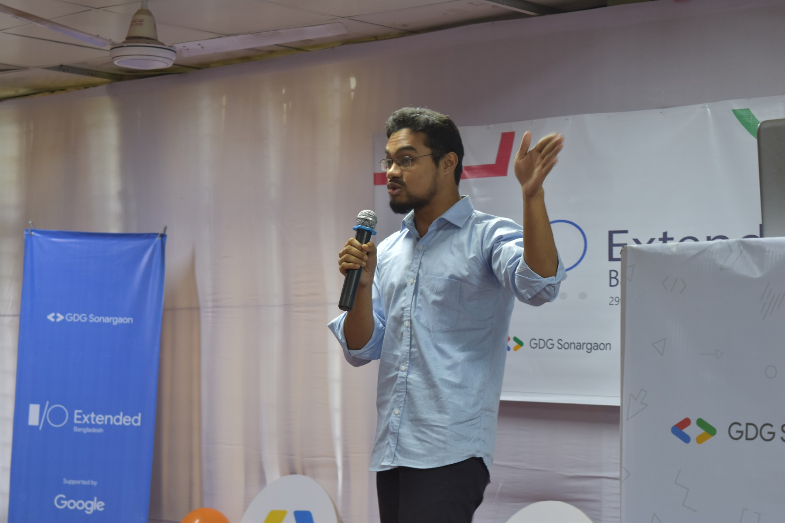
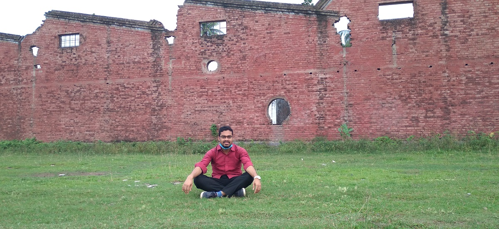

# Gallery {- #gallery}

## Random Moments {- #random-tours}


```{r miu, echo=FALSE, fig.cap = "Lecture At MIU.", fig.align='center', out.width = '60%'}
knitr:: 
```

```{r sangla, echo=FALSE, fig.cap = "Sangla, Kinnaur, Hiamchal Pradesh, India", fig.align='center', out.width = '60%'}
knitr:: include_graphics("img/sangla.JPG")
```

```{r lal, echo=FALSE, fig.cap = "Roaming at Lalmai.", fig.align='center', out.width = '60%'}
knitr:: include_graphics("img/lalmai.jpg")
``` 

```{r cbil, echo=FALSE, fig.cap = "Roaming at Cholonbil.", fig.align='center', out.width = '60%'}
knitr:: include_graphics("img/cholonbil.jpg")
``` 


```{r mill, echo=FALSE, fig.cap = "Roaming in Pabna.", fig.align='center', out.width = '60%'}
knitr:: 
```

# Websites {-}

- [Statistics Lectures](https://lecture.statmania.info/): Academic Lectures
- [Stat Mania](https://www.statmania.info/): Web portal on statistics (esp. with R programming) and mathematics, and Linux
-  [মহাবিশ্ব](https://sky.bishwo.com):Web portal on astronomy and cosmology
- [Academic Lectures](https://lecture.statmania.info/pres.html)
- [R Programming Online](https://rstat.statmania.info/)
- [Blog](/blog)

# Contact {-}

Scan the QR code below to add my contact details to your phone

```{r echo=FALSE, fig.cap = "Contact Details", fig.align='center', out.width = '60%'}
knitr:: include_graphics("images/qr_mahmud.png")
```

**Email:** almahmud.sbi[at]gmail.com

**Facebook:** [mahmud.sbi](https://www.facebook.com/mahmud.sbi)

**Linked In:** [mahmudstat](https://www.linkedin.com/in/mahmudstat/t)
