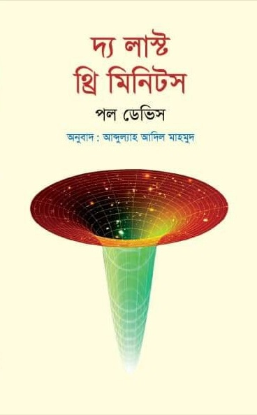
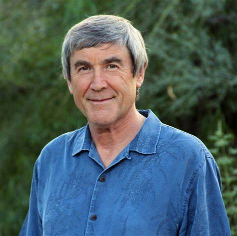
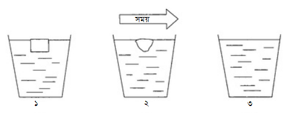
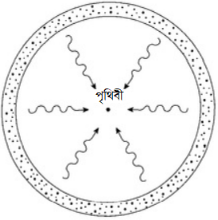
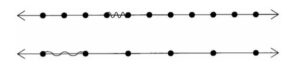
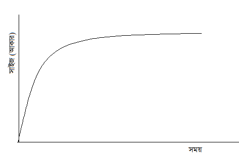
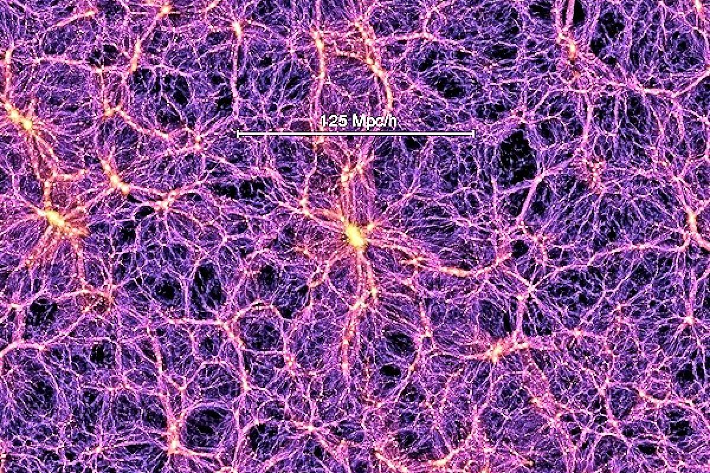
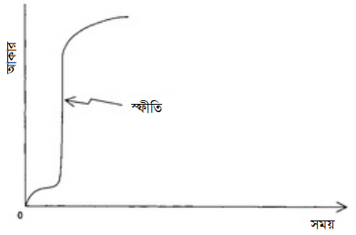

# দ্য লাস্ট থ্রি মিনিটস{#l3m}

```{r cover, echo=FALSE, fig.cap = "Cover", fig.align = 'center', out.width = '70%'}
knitr:: 
```

এটি অ্যামেরিকান পদার্থবিদ পল ডেভিসের লেখা *[দ্য লাস্ট থ্রি মিনিটস (The Last Three Minutes)](https://www.goodreads.com/book/show/797498.The_Last_Three_Minutes)* বইয়ের বাংলা অনুবাদ। বইটির মূল আলোচ্য বিষয় মহাবিশ্বের ভবিষ্যৎ। 

বর্তমানে আমরা জানি, আজ থেকে প্রায় ১৩৮০ কোটি বছর আগে এক বিস্ফোরণের মাধ্যমে মহাবিশ্বের যাত্রা শুরু। ধীরে ধীরে এতে জন্ম নিয়েছে নক্ষত্র, গ্রহ, নীহারিকা, ছায়াপথ, কৃষ্ণগহবরা। আমরা মহাবিশ্বের যত দূরে তাকাই, মহাবিশ্বের তত আগের অবস্থা দেখতে পাই। 

কিন্তু ভবিষ্যৎ? আজ থেকে কয়েক শ কোটি বছর পরে কী ঘটবে মহাবিশ্বের ভাগ্যে? 

এটা কি বর্তমানের মতো প্রসারিত হতে থাকবে? নাকি আবার শুরু হবে সঙ্কোচন? পৃথিবীর ভাগ্যেই বা কী আছে? কী আছে ভবিষ্যতের মানুষের ভাগ্যে? সঙ্কোচনশীল মহাবিশ্বটা দেখতে কেমন হবে? এসব প্রশ্নের উত্তর খুব দারুণভাবে দেওয়া হয়েছে বইটিতে। 

বইটি নব্বইয়ের দশকে লেখা হলেও এর বিষয়বস্তু বর্তমান সময়েও আবেদন ধরে রাখতে সক্ষ্ম হয়েছে। বইটি লেখার পরে কিছু গুরুত্বপুর্ণ বৈজ্ঞানিক আবিষ্কার ঘটেছে। অনুবাদক পরিশিষ্ট ও এগারোতম অধ্যায়ের শেষের নোটের মাধ্যমে বিজ্ঞানের অগ্রগতিকে বইটির আলোচ্য বিষয়ের সাথে সমন্বয় করেছেন। 

### বই কিনতে

বইটি একুশে বইমেলা-২০২১-এ প্রকাশিত হয়েছে। পাওয়া যাবে রকমারি ডট কম ও প্রথমা ডট কমে। 

- রকমারি লিঙ্ক:[লেখকের রকমারি পেইজ](https://www.rokomari.com/book/author/47631)
- প্রথমা: [লিঙ্ক](https://www.prothoma.com/product/11381/দ্য-লাস্ট-থ্রি-মিনিটস)


### লেখক পরিচিতি 

**পল ডেভিস**  

```{r author, echo=FALSE, fig.cap = "Author", fig.align = 'center', out.width = '50%'}
knitr:: 
```

ইংরেজ পদার্থবিদ। বর্তমানে যুক্তরাষ্ট্রের অ্যারিজোনা স্টেট ইউনিভার্সিটির অধ্যাপক। যুক্ত আছেন ক্যলিফোর্নিয়ার চ্যাপম্যান ইউনিভার্সিটির ইনস্টিটিউট ফর কোয়ান্টাম স্টাডিজ প্রতিষ্ঠানের সাথেও। এর আগে অন্যান্যের মধ্যে ইউনিভার্সিটি অব ক্যামব্রিজ ও ইউনিভার্সিটি কলেজ লন্ডনেও অধ্যাপনা করেছেন। গবেষণার বিষয় কসমোলজি (মহাবিশ্বতত্ত্ব), কোয়ান্টাম ক্ষেত্র তত্ত্ব ও অ্যাস্ট্রোবায়োলজি। 

তিনিই প্রথম যৌথ একটি গবেষণাপত্রে দেখিয়েছেন, হকিং বিকিরণের মাধ্যমে ব্ল্যাক হোল বাষ্পীভূত হওয়ার জন্যে আশেপাশের এলাকা থেকে ব্ল্যাক হোলের মধ্যে ঋণাত্মক শক্তির প্রবেশ দায়ী। এছাড়াও দীর্ঘ সময় কাজ করেছেন সময় নিয়ে। 

বিজ্ঞানকে জনপ্রিয় করার কাজে তাঁর অবদান অসামান্য। অনেকগুলো টেকনিকেল ও জনপ্রিয় বইয়ের লেখক তিনি। টেকনিকেল বইয়ের মধ্যে অন্যতম *দ্য ফিজিক্স অব টাইম অ্যাসিমেট্রি* (১৯৭৪)। এছাড়াও লিখেছেন জনপ্রিয় বই *দ্য এজ অব ইনফিনিটি*, *দ্য রানওয়ে ইউনিভার্স*, *দ্য কসমিক ব্লুপ্রিন্ট*, *অ্যাবাউট টাইম: আইনস্টাইন’স আনফিনিশড বিজনেস*, *কোয়ান্টাম অ্যাসপেক্টস অব লাইফ* ইত্যাদি। 

ভূষিত হয়েছেন অনেকগুলো পুরষ্কারে। যার মধ্যে অন্যতম ইউরেকা প্রাইজ, কেলভিন পদক, ফ্যারাডে প্রাইজ ও টেম্পেলটন প্রাইজ। 

### লেখকের ভূমিকা 

১৯৬০ এর দশকের শুরুর দিকের কথা। আমি ছাত্র তখন। মহাবিশ্বের শুরুর  রহস্য জানার অপরিসীম কৌতূহল সবার চোখে-মুখে। বিগ ব্যাং তত্ত্বের জন্ম সেই ১৯২০ এর দশকে হলেও একে গুরুত্বের সাথে নেওয়া শুরু ১৯৫০ এর দশকের পরে। সবাই এর সাথে পরিচিত থাকলেও তত্ত্বটি তখনও তেমন কোনো আস্থা অর্জন করতে পারেনি। ওদিকে শক্ত প্রতিদ্বন্দ্বী হিসেবে আছে স্থির অবস্থা তত্ত্ব (steady-state theory)। মহাবিশ্বের কোনো শুরু থাকতে পারে সে সম্ভাবনাই এটি নাকচ করে দিয়েছে। বিভিন্ন মহলের কাছে এটি তখনও সবচেয়ে গহণযোগ্য তত্ত্ব। এরপর ১৯৬৫ সালে এল রবার্ট পেনজিয়াস ও আর্নো উইলসনের আবিষ্কার এল। মহাজাগতিক পটভূমি তাপ বিকিরণ। দৃশ্যপট পুরোপুরি পাল্টে গেল। পরিষ্কারভাবে প্রমাণিত হলো, একটি উত্তপ্ত, উন্মত্ত ও আকস্মিক অবস্থা থেকে শুরু মহাবিশ্বের। 

কসমোলজিস্টরা এই আবিষ্কারের ফলাফল বের করতে উঠেপড়ে লাগলেন। বিগ ব্যাংয়ের ১০ লাখ বছর পরে মহাবিশ্ব কতটা উত্তপ্ত ছিল? এক বছর পর? এক সেকেন্ড পর? সেই প্রারম্ভিক চুল্লিতে কোন ধরনের ভৌত প্রক্রিয়া সংঘটিত হয়েছিল? সৃষ্টির শুরর কোনো ধ্বংসাবশেষ বাকি আছে কি? যা থেকে জানা যাবে সেই সময়ের চরম অবস্থার খবর। 

আমার ভালোমতো মনে আছে, ১৯৬৮ সালে একটি লেকচার শুনতে গিয়েছিলাম। সবশেষে অধ্যাপক পটভূমি তাপ বিকিরণের (cosmic background heat radiation) আবিষ্কারের আলোকে বিগ ব্যাং নিয়ে কথা বললেন। হাসিমুখে বললেন, “বিগ ব্যাং এর পরের প্রথম তিন মিনিটে সংঘটিত নিউক্লিয় প্রক্রিয়ার ওপর ভিত্তি করে কিছু তাত্ত্বিক মহাবিশ্বের রাসায়নিক উপাদানের বিবরণ দিয়েছেন।” দর্শকরা হাসিতে ফেটে পড়লেন। মহাবিশ্বের জন্মের মাত্র সামান্য সময় পরের অবস্থার বিবরণ দেওয়ার চেষ্টা কতই না হাস্যকর! এমনকি সপ্তদশ শতকের যাজক জেমস উশারও এমন দুঃসাহস করেননি। অথচ তিনিই কিন্তু বাইবেলের ক্রমানুপুঞ্জির ওপর ভিত্তি করে দাবি করেছিলেন, ৪০০৪ খৃষ্টপূর্ব সালের ২৩ অক্টোবর তারিখে সৃষ্টি হয়েছিল মহাবিশ্বের। প্রথম তিন মিনিটের ঘটনা প্রবাহের নিখুঁত বর্ণনা কিন্তু তিনিও দিতে চেষ্টা করেননি। 

কিন্তু মহাজাগতিক তাপ বিকিরণ আবিষ্কারের মাত্র এক দশকের মধ্যেই পাল্টে গেল বিজ্ঞানের গতি । প্রথম তিন মিনিট ছাত্রদেরও মনোযোগ কেড়ে নিল। বই লেখা হতে লাগল। ১৯৭৭ সালে অ্যামেরিকান পদার্থবিদ ও কসমোলজিস্ট স্টিভেন উইনবার্গ লিখলেন একটি বেস্ট সেলার বই। শিরোনাম দ্য ফার্স্ট থ্রি মিনিটস বা প্রথম তিন মিনিট। জনপ্রিয় বিজ্ঞান প্রকাশনার জগতে এটি নতুন ধারার প্রবর্তন করে। লেখক বিশ্ববিখ্যাত একজন পণ্ডিত। বিগ ব্যাংয়ের ঠিক পরের প্রক্রিয়াগুলো সাধারণ পাঠকের জন্যে লিখেছেন বিস্তারিত ও বোধগম্য করে।

এক দিকে উত্তেজক আবিষ্কারগুলো সাধারণ মানুষ আস্তে আস্তে বুঝতে শুরু করেছেন। ওদিকে বিজ্ঞানীরাও বসে নেই। আগ্রহের বিষয় গেল পাল্টে। এক সময় আগ্রহের বিষয় ছিল মহাবিশ্বের প্রারম্ভিক অবস্থার খোঁজ জানা। মানে জন্মের প্রায় কয়েক মিনিট পরের কথা। আর এখন আগ্রহের বিষয় হয়ে গেলে তারও অনেক আগের খবর। জন্মের এক সেকেন্ডের প্রায় অসীম ভগ্নাংশ সময় পরের অবস্থা। তার প্রায় এক দশক পরে ব্রিটিশ গাণিতিক পদার্থবিদ স্টিফের হকিং লিখলেন অ্যা ব্রিফ হিস্টরি অব টাইম। এক সেকেন্ডের দশ কোটি কোটি কোটি কোটি কোটি ভাগের এক ভাগ সময়ে কী ঘটেছিল তাও বললেন তিনি। ১৯৬৮ সালের সেই লেকচারের শেষ হাসিটুকই আজ হাস্যকর হয়ে গেছে। 

বিগ ব্যাং তত্ত্ব এখন বিজ্ঞানী ও সাধারণ মানুষের আস্থা অর্জন করে ফেলেছে। ফলে এখন বেশি চিন্তা-ভাবনা চলছে মহাবিশ্বের ভবিষ্যত নিয়ে। মহাবিশ্বের শুরুর খবর আমরা ভালোই জানি। কিন্তু এর পরিণতি কেমন হবে? এর চূড়ান্ত  পরিণতি সম্পর্কে কী বলা যায়? শেষও কি হবে ব্যাং (বিস্ফোরণ) বা আর্তনাদের মাধ্যমে? বা আদৌ কি এর শেষ আছে? আমাদেরই বা কী হবে? আমরা বা আমাদের পরের প্রজন্ম কি চিরকাল টিকে থাকবে? যদিওবা সেটা হয় রক্ত-মাংসের গড়া বা রোবোটিক শরীর। 

বিষয়গুলো নিয়ে কৌতূহলী না হয়েও উপায় নেই। যদিও পৃথিবীর শেষ এখনও দূরে আছে বলেই মনে হচ্ছে। বর্তমানে মানব-সৃষ্ট নানা সমস্যায় জর্জরিত পৃথিবীতে আগে আমরা নিছক পৃথিবীতে টিকে থাকার সংগ্রাম নিয়ে চিন্তা করতাম। এখন ঘুরে গেছে সে চিন্তার মোড়। আমাদেরকে এখন আমাদের অস্তিতের মহাজাগতিক দিক নিয়ে ভাবতে হচ্ছে। দ্য লাস্ট থ্রি মিনিটস বইয়ে বলব ভবিষ্যত মহাবিশ্বের গল্প। বিখ্যাত কিছু পদার্থবিদ ও কসমোলজিস্টদের সর্বশেষ চিন্তার আলোকে সবচেয়ে সেরা অনুমানটুকুই আমরা তুলে ধরব। এটা কল্পনানির্ভর হবে না। সত্যি বলতে, ভবিষ্যতে নজিরবিহীন অনেক কিছুই ঘটতে পারে। কিন্তু ভুলে গেলে চলবে না, যেটা একবার অস্তিত্বে আসতে পারে, সেটা অস্তিত্ব হারাতেও পারে। 

এ বইটি সাধারণ পাঠকের জন্যে লেখা। বিজ্ঞান বা গণিতের কোনো পূর্ব জ্ঞান না থাকলেও চলবে। তবে, মাঝেমাঝেই আমাকে অনেক বড় বা অনেক ছোট সংখ্যা নিয়ে কথা বলতে হবে। এ ক্ষেত্রে ১০ এর ঘাত (পাওয়ার) ভিত্তিক সংক্ষিপ্ত গাণিতিক প্রতীক ব্যবহার করলে সুবিধা হবে। যেমন, দশ হাজার কোটিকে লিখতে গেলে ১০০,০০০,০০০,০০০ লিখতে হয়। এটা অসুবিধাজনক। এখানে ১ এর পরে ১১টি শূন্য আছে। ফলে, আমরা একে ১০^১১^ বা ১০ এর ১১তম ঘাত আকারে লিখতে পারি। একইভাবে দশ লক্ষ হলো ১০^৬^, এক লক্ষ কোটি হলো ১০^১২^ ইত্যাদি। তবে মনে রাখতে হবে, এই প্রতীকের মাধ্যমে সংখ্যাগুলোর বৃদ্ধির হার সরাসরি বোঝা কঠিন। ১০^১২^ সংখ্যাটি ১০^১০^ এর একশ গুণ। প্রায় একই মনে হলেও পার্থক্যটা কিন্তু বিশাল। ১০ এর পাওয়ার ঋণাত্মক বসিয়ে আবার খুব ছোট সংখ্যাদেরকেও প্রকাশ করা যায়। যেমন, একশ কোটির এক ভাগ বা ১/১,০০০,০০০,০০০ কে ১০^-৯^  (টেন টু দ্য পাওয়ার মাইনাস নাইন) লেখা যায়। কারণ, ভগ্নাংশের হরে ১ এর পরে ৯টি শূন্য আছে। 

শেষমেশ পাঠককে একটা কথা বলে রাখি। স্বাভাবিকভাবেই বইটির অনেকটাই অনুমান নির্ভর। হ্যাঁ, বইয়ের অধিকাংশ কথাই বর্তমান বিজ্ঞানের সেরা তথ্যের আলোকেই বলা হয়েছে। কিন্তু এরপরেও ভবিষ্যদের পূর্বাভাস অন্যান্য বৈজ্ঞানিক তথ্যের সমান মর্যাদা পেতে পারে না। তবুও মহাবিশ্বের চূড়ান্ত পরিণতি নিয়ে অনুমান করার লোভ সামলানো সম্ভব নয়। এই খোলা মনের আলোকেই বইটি লেখা। বৈজ্ঞানিকভাবে এ কথাগুলো মোটামুটি স্বীকৃত যে বিগ ব্যাং এর মাধ্যমে মহাবিশ্বের শুরু হয়েছে, এখন এটি শীতল ও প্রসারিত হতে হতে বিপরীত ধর্মের কোনো চূড়ান্ত অবস্থার দিকে এগিয়ে যাচ্ছে, অথবা হয়ত উন্মত্তভাবে সংকুচিত হয়ে যাবে। তবে যে সুদীর্ঘ সময় নিয়ে আমরা কথা বলছি, তাতে কোন ভৌত প্রক্রিয়া যে প্রভাবশালী ভূমিকা রাখবে তা খুব বেশি নিশ্চিত করে বলার সুযোগ নেই। সাধারণ নক্ষত্রের পরিণতি সম্পর্কে জ্যোতির্বিজ্ঞানীদের ধারণা মোটামুটি পরিষ্কার। নিউট্রন নক্ষত্র ও ব্ল্যাক হোলের মৌলিক বৈশিষ্ট্য সম্পর্কেও তাঁদের ধারণা দিন দিন সমৃদ্ধ হচ্ছে। কিন্তু যদি মহাবিশ্ব আরও লক্ষ কোটি বছর বা তারও বেশি সময় টিকে থাকে, তাহলে এতে এমন কোনো সূক্ষ্ম ভৌত প্রতিক্রিয়া ঘটতেও পারে, যা সম্পর্কে আমাদের অনুমান করা ছাড়া কিছু করার নেই। এক সময় হয়ত সেটাই হবে গুরুত্বপূর্ণ প্রতিক্রিয়া। 

প্রকৃতি সম্পর্কে আমাদের জ্ঞান কিন্তু অসম্পূর্ণ। ফলে মহাবিশ্বের চূড়ান্ত পরিণতি জানার চেষ্টা ও অনুমান করার উপায় আছে একটিই। আমাদের হাতে যেসব তত্ত্ব আছে সেগুলোকে কাজে লাগিয়েই যুক্তিভিত্তিক কোনো সিদ্ধান্তে পৌঁছতে হবে। কিন্তু এতেও সমস্যা আছে। মহাবিশ্বের পরিণতি বিষয়ক অনেকগুলো তত্ত্বেরই এখন পর্যন্ত প্রায়োগিক পরীক্ষা হয়নি। এমন কিছু বিষয়েও আলোচনা করেছি যেগুলো নিয়ে তাত্ত্বিকরা খুব আশাবাদী, কিন্তু এখনও তার প্রমাণ মেলেনি। যেমন, মহাকর্ষ তরঙ্গ নির্গমন [^1], প্রোটন ক্ষয় (proton decay) ও ব্ল্যাক হোল রেডিয়্যান্স। আবার একইভাবে এমন কোনো ভৌত প্রক্রিয়াও নিশ্চয়ই থাকবে যা আমরা এখন একেবারেই জানি না। হয়ত সেটা এ বইয়ের কথাগুলোকে বহুলাংশে পাল্টে দেবে। 

মহাবিশ্বে বৃদ্ধিমান প্রাণীর সম্ভাব্য কার্যক্রমের কথা ভাবলে এই অনিশ্চয়তাই আরও বড় হয়ে দেখা দেয়। এবারে আমরা বিজ্ঞান কল্পকাহিনির জগতে প্রবেশ করে ফেলেছি। তবুও এমনটাতো হতেই পারে যে কালের আবর্তনে এক সময় জীবিত প্রাণীরা ভৌত সিস্টেমের আচরণ ক্রমেই বড় পরিসরে উল্লেখযোগ্য রকম পরিবর্তন করে ফেলল। মহাবিশ্বের প্রাণ সম্পর্কেও আমি আলোচনা করেছি। কারণ, অনেক পাঠক মহাবিশ্বের পরিণতি জানতে চান মূলত মানুষ বা তার পরবর্তী প্রজন্মের পরিণতি জানার জন্যেই। তবে মনে রাখতে হবে মানুষের চেতনার প্রকৃতি সম্পর্কে এখনও বিজ্ঞানীরা সঠিক করে কিছুই জানেন না। এটাও জানা নেই যে দূর ভবিষ্যতে অস্তিত্ব টিকিয়ে রাখতে হলে চেতনার মধ্যে কোন কোন গুণাবলীগুলো থাকা প্রয়োজন। 

বইটির বিষয়বস্তু সম্পর্কে সহায়ক আলোচনায় অংশ নেওয়ার জন্যে কয়েকজন মানুষকে ধন্যবাদ দিতেই হয়। এঁরা হলেন জন ব্যারো, ফ্র্যাংক টিপলার, জ্যাসন টমলি, রজার পেনরোজ ও ডানকান স্টিল। সিরিজের সম্পাদক জেরি লিয়ন পাণ্ডুলিপি গুরুত্বের সাথে পড়ে দিয়েছিলেন। এজন্যে তাঁকেও ধন্যবাদ। চূড়ান্ত পাণ্ডুলিপিতে কাজ করার জন্যে স্যারা লিপিনকটকেও ধন্যবাদ। 

### অনুবাদকের ভূমিকা

মহাবিশ্ব নিয়ে সবচেয়ে বড় দুটি প্রশ্নের একটি মহাবিশ্বের ভবিষ্যৎ। আরেকটি তো জানাই। মহাবিশ্বের অতীত। মানে কীভাবে জন্ম হয়েছিল মহাবিশ্বের। এই দুটো প্রশ্নের উত্তর পেলেই পুরো মহাবিশ্বের ইতিহাস জানা হয়। মহাবিশ্বের অতীত নিয়ে নোবেলজয়ী পদার্থবিদ স্টিভেন উইনবার্গ লিখেছেন কালজয়ী বই দ্য ফার্স্ট থ্রি মিনিটস। এই বইটির নাম দ্য লাস্ট থ্রি মিনিটস। বলাই বাহুল্য, নামটি যথেষ্ট সার্থক হয়েছে। দ্য লাস্ট থ্রি মিনিটস বইটি নব্বইয়ের দশকে লেখা। বর্তমান সময়ের আলোকে তাই একে কিছুটা সেকেলে মনে হওয়া স্বাভাবিক। 

বইটি লেখার পরে কিছু যুগান্তকারী আবিষ্কার ঘটেছে জ্যোতির্বিদ্যায়। বইটির আলোচ্য বিষয়ের সাথে প্রাসঙ্গিক একটি আবিষ্কার হলো ১৯৯৮ সালের মহাবিশ্বের ত্বরিত প্রসারণ। এর মাধ্যমে জানা গেল, দূরের ছায়াপথরা কোনো পর্যবেক্ষক থেকে যত দূরে সরছে ততই তাদের দূরে সরার বেগ বাড়ছে। 

এ আবিষ্কারের মাধ্যমে মহাবিশ্বের সম্ভাব্য ভবিষ্যৎ সম্পর্কে ধারণায় কিছু পরিবর্তন আসে। এর ফলে বইয়ের অল্প কিছু তথ্য আপাতদৃষ্টিতে সেকেলে হয়ে গেছে। তবে পুরোপুরি সেকেলে হয়নি। বইটির শেষের দিকে মহাসঙ্কোচন নিয়ে আলোচনা করা হয়েছে। বর্তমান জ্ঞান বলছে, মহাবিশ্ব আবার গুটিয়ে যাবে সে সম্ভাবনা কম। তবে ঘটবেই না এমনটা বলা সম্ভব না। ফলে, বইটির ঐ আলোচনা অর্থহীন নয়। তাছাড়া মহাসঙ্কোচন একেবারে বাতিল হয়ে গেলেও এর সম্ভাব্য কৌশল ও ফলাফল কী হবে সেটা নিয়ে বইটির আলোচনা যথেষ্ট কৌতূহলোদ্দীপক। 

বইটির আলোচ্য বিষয়কে যুগোপযোগী করে তুলতে বইটির পরিশিষ্ট অংশে মহাবিশ্বের সম্ভাব্য পরিণতিগুলো বিষয়ক একটি লেখা যুক্ত করেছি। যুক্ত করেছি বিজ্ঞান, বৈজ্ঞানিক তত্ত্ব বিজ্ঞান কীভাবে কাজ করে তা নিয়ে একটি অংশও। বিজ্ঞানের সঠিক রূপ সম্পর্কে আমাদের দেশে ভুল ধারণা সঠিক ধারণার চেয়ে বেশি দেখা যায়। এ কারণে আমরা অনেকসময় নানান বিষয় নিয়ে অহেতুক তর্কে জড়িয়ে বিভিন্ন সামাজিক সমস্যার অংশ হয়ে পড়ি। 

অত্যন্ত সতর্ক থাকা সত্ত্বেও বইটিতে কিছু ত্রুটি থেকে যাওয়া অসম্ভব নয়। যেকোনো ধরনের ত্রুটি চোখে পড়লে ইমেইলের মাধ্যমে আমাকে জানালে অত্যন্ত কৃতজ্ঞ থাকব। কোনো পরামর্শ থাকলেও জানানোর অনুরোধ রইল। 

বইটি লেখার ক্ষেত্রে পরিবারের সদস্যদের, বিশেষ করে সহধর্মিনী সালমা সিদ্দিকার অকৃত্রিম উৎসাহ ও পরমার্শের জন্য তাঁদের সবার প্রতি ঐকান্তিকভাবে কৃতজ্ঞতা প্রকাশ করছি। বরাবরের মতোই বইটি প্রকাশে বিজ্ঞানচিন্তার বাসার ভাই ও রনির ভাইয়ের ক্রমাগত ও নিঃসার্থ উৎসাহ দেওয়ার কথা আজীবন মনে থাকবে। এজন্য তাঁদের কাছে বিশেষভাবে কৃতজ্ঞ। বইটির প্রকাশ করার জন্যে প্রথমা প্রকাশনের প্রকাশক ও প্রকাশনার সাথে বিভিন্নভাবে জড়িত সবার প্রতিও অপরিসিম কৃতজ্ঞতা। 

মাহমুদ

০৮ অক্টোবর, ২০২০ 

পাবনা ক্যাডেট কলেজ 


**অনুবাদকের নোট**

[^1]: ২০১৬ সালের ফেব্রুয়ারি মাসে এ তরঙ্গ পাওয়ার ঘোষণা দেওয়া হয়। অবশ্য পাওয়া গিয়েছিল আগের বছরের অক্টোবরেই। ফলে বইটির গুরুত্ব বাড়ল বলা চলে। 

## মহাপ্রলয় {#doomsday}

**তারিখ:** *২১ আগস্ট, ২১২৬। মহাপ্রলয়*

**স্থান:** পৃথিবী। 

*পৃথিবীর নানা প্রান্তে হতাশায় আচ্ছন্ন অনেকগুলো মানুষ লুকানোর চেষ্টায় ব্যস্ত। কোটি কোটি মানুষ আশ্রয়হীন হয়ে পড়েছে। কেউ কেউ পালিয়েছে ভূমির গভীরে। আশ্রয় নিয়েছে গুহা বা খনির দেয়ালে। কেউ আবার সাবমেরিনে চেপে সাগরে ডুব দিয়েছে। কেউ কেউ বেপরোভাবে এদিক-সেদিক ছোটাছুটি করছে। তবে অধিকাংশ মানুষই হতবুদ্ধি ও বিষণ্ণ হয়ে বসে আছে। অপেক্ষা করছে শেষ পরণতির জন্যে। *

*আকাশের অনেক উঁচুতে আলোর একটি বড় রেখা দেখা যাচ্ছে। শুরুতে শুধু দেখা গিয়েছিল হালকা ধোঁয়ার মুদু বিকিরণ। একদিন সেটাই মহাশূন্যের বুকে গড়ে তুলল ফুটন্ত গ্যাসের প্রচণ্ড ঘুর্ণি। গ্যাসের ওপরের দিকে একটি কালো, কুৎসিত ও ভয়ানক জিনিস দেখা যাচ্ছে। ধূমকেতুটির ক্ষুদ্র মাথা দেখে এর ভয়ানক ধ্বংসাত্মক ক্ষমতা আঁঁচ করা কঠিন। সেকেন্ডে প্রায় চল্লিশ হাজার মাইল বেগে এটি ধেয়ে আসছে পৃথিবীর দিকে। প্রতি সেকেন্ডে দশ মাইল। লক্ষ কোটি টন বরফ ও পাথর শব্দের সত্তর গুণ বেগে পৃথিবীতে আঘাত হানার জন্যে প্রস্তুত।  *

*দেখা ও অপেক্ষা করা ছাড়া মানুষের করার কিছুই নেই। অনিবার্য পরিণতির মুখে পড়ে বিজ্ঞানীরা বহু আগেই টেলিস্কোপ থেকে মুখ সরিয়ে নিয়েছেন। নিরবে বন্ধ করে দিয়েছেন কম্পিউটার। দূর্যোগের সঠিক আচরণ এখনও সঠিকভাবে বোঝ যাচ্ছে না। যেটুকু জানা গেছে, সেটাই এত ভয়াবহ যে তা সাধারণ মানুষকে জানানো ঠিক হবে না। কোনো কোনো বিজ্ঞানী টিকে থাকার কিছু পূর্ণাঙ্গ কৌশল তৈরি করেছেন। নিজেদের টেকনিক্যাল জ্ঞান কাজে লাগিয়ে অন্যদের তুলনায় সুবিধাজনক অবস্থায় থাকার ইচ্ছে তাদের। কেউ কেউ দূর্যোগটিকে মনোযোগ দিয়ে পর্যবেক্ষণের চেষ্টারত। শেষ দিনটি পর্যন্তও তাঁরা তাঁদের সত্যিকার বিজ্ঞানীসুলভ আচরণ বজায় রাখতে চাচ্ছেন। পৃথিবীর গভীরে রাখা টাইম ক্যাপসুলে পাঠিয়ে দিচ্ছেন সে উপাত্ত। উদ্দেশ্য, ভবিষ্যত্ বংশধররা যাতে সেটা কাজে লাগাতে পারেন।  *

*সংঘর্ষের মুহূর্ত আরও ঘনিয়ে এল। সারা পৃথিবীর লাখ লাখ মানুষ ভয়ে ভয়ে ঘড়ির দিকে তাকাচ্ছে। শেষ তিনটি মিনিট। 
গ্রাইন্ড জিরোর ঠিক ওপরে আকাশ বিদীর্ণ হয়ে গেল। এক হাজার ঘন মাইল পরিমাণ বায়ু ছুটে গেল একদিকে। একটি শহরের আকারের চেয়েও বেশি পরিমাণ ধোঁয়া কুণ্ডলী পাকিয়ে ভূমির দিকে এগিয়ে আসছে। পনের সেকেন্ড পরেই আঘাত হানল ভূপৃষ্ঠে। দশ হাজার ভূমিকম্পের সমান আঘাতে কেঁপে ওঠল পৃথিবী। স্থানান্তরিত বাতাসের শক ওয়েভ উড়ে যাচ্ছে পৃথিবী পৃষ্ঠের ওপর দিয়ে। ভেঙে পড়ল স্থাপনাগুলো। যেটাই সামনে পড়ল, নিশ্চিহ্ন হয়ে গেল। সংঘর্ষের স্থানের চারপাশে সমতল ভূমিতে একটি বৃত্তাকার তরল পাহাড় তৈরি হলো। উচ্চতা কয়েক মাইল। একশো মিটার চওড়া গর্ত দিয়ে পৃথিবীর ভেতরের বস্তু বেরিয়ে আসছে। গলিত পাথরের দেয়াল ঢেউ তুলে ছড়িয়ে পড়ছে ধীরে ধীরে। এ তীব্র আঘাতের সামনে ভূপৃষ্ঠ যেন সামান্য একটি কম্বল।*

*গর্তের ভেতরের লক্ষ কোটি টন পাথর বাষ্পীভূত হয়ে গেছে। তার চেয়ে অনেক বেশি ছিটকে ওপরে উঠে যাচ্ছে। কিছু কিছু চলে যাচ্ছে মহাকাশের দিকেও। এর চেয়ে বেশি পরিমাণে নিক্ষিপ্ত হচ্ছে অর্ধ-মহাদেশ এলাকা জুড়ে। এরপর পতিত হচ্ছে শত শত, এমনকি হাজার হাজার মাইল দূরের এলাকায়। যেখানেই তা পড়ছে, ঘটাচ্ছে মারাত্মক ধ্বংসযজ্ঞ। কিছু কিছু নিক্ষিপ্ত পদার্থ গিয়ে পড়ছে সাগরে। সেট থেকে শুরু হচ্ছে সুনামি। ফলে দূর্যোগের মাত্রা আরও বৃদ্ধি পেল। ধুলোময় ধ্বংসাবশেষের একটি বড় অংশ বায়ুমণ্ডলে উঠে গেল। সূর্য পুরোপুরি ঢাকা পড়ে গেল। সূর্যের আলোর মুখ দেখা যাচ্ছে না পৃথিবীর কোথাও থেকেই। তার বদলে দেখা যাচ্ছে শত কোটি উল্কার পৈশাচিক ঝলকানি। তীব্র উত্তাপ পাঠিয়ে এরা ঝলসে দিচ্ছে মাটির পৃথিবী। কারণ বিচ্ছিন্ন খণ্ডগুলো মহাশূন্য থেকে ফের ফিরে আসছে বায়ুমণ্ডলে।*  

উপরের দৃশ্যপটটি একটি অনুমান। সু্ইফট টাটল (Swift-Tuttle) নামের একটি ধূমকেতু ২১২৬ সালের ২১ আগস্ট তারিখে পৃথিবীতে আঘাত হানবে। যদি সেটাই ঘটে, বৈশ্বিক দূযোর্গ অবধারিত। ইতি ঘটবে মানুষেরও। ১৯৯৩ সালে একে দেখার পরে হিসাব-নিকাশ করে দেখা গেল ২১২৬ সালে আসলেও একটি সংঘর্ষ হতে যাচ্ছে। পরে সংশোধিত হিসাবে দেখা যায়, এটি এক সপ্তাহের জন্যে পৃথিবীকে মিস করবে। অল্পের জন্য বাঁচা। আমরা এর দিক থেকে নিশ্চিন্তেই থাকতে পারি। তবে বিপদ যে একেবারেই নেই তা কিন্তু নয়। আজ হোক, কাল হোক, সুইফট টাটল বা এরই মতো কেউ পৃথিবীতে আঘাত হানবেই। হিসেব করে দেখা গেছে, অর্ধ-কিলোমিটার বা তারও বেশি চওড়া দশ হাজার বস্তুর কক্ষপথ পৃথিবীর কক্ষপথের ওপর দিয়ে গেছে। বিশাল বিশাল এই উপদ্রপগুলোর জন্ম সৌরজগতের বহিঃস্থ শীতল এলাকায়। কিছু কিছু হলো ধূমকেতুর ধ্বংসাবশেষ। আটকা পড়ে আছে গ্রহদের মহাকর্ষীয় বাঁধনে। অন্যদের উৎপত্তি গ্রহাণু বেষ্টনীতে (asteroid belt)। জায়গাটা মঙ্গল ও বৃহস্পতি গ্রহের মাঝখানে। কক্ষপথের ভারসাম্যহীনতার কারণে এরা নিয়মিত সৌরজগতে আসা-যাওয়া করছে। আকারে ছোট হলেও এদের প্রতিক্রিয়া ভয়ঙ্কর। পৃথিবী ও অন্য গ্রহদের স্থায়ী বিপদের কারণ। 

এ বস্তুগুলোর মধ্যে অনেকগুলোই পৃথিবীর সবগুলো নিউক্লিয়ার অস্ত্রের চেয়েও বেশি ক্ষতিসাধন করতে সক্ষম। যে-কোনো সময় কোনো একটি আঘাত হানতে পারে। সেটা মানুষের জন্যে একটি খারাপ খবরই হবে। সেটা হবে মানব ইতিহাসের একটি আকস্মিক ও নজিরবিহীন প্রতিবন্ধক। কিন্তু পৃথিবীর ক্ষেত্রে এ রকম ঘটনা মোটামুটি নিয়ম মেনে চলে। ধূমকেতু বা গ্রহাণুর এ মাত্রার সংঘর্ষ গড়ে কয়েক মিলিয়ন [^1] বছরে একবার ঘটে। অনেকের বিশ্বাস, এ ধরনের এক বা একাধিক ঘটনার ফলেই সাড়ে ছয় কোটি বছর আগে ডাইনোসররা বিলুপ্ত হয়ে গিয়েছিল। পরের বার হয়ত আমাদের পালা। 

অনেক ধর্ম ও সংস্কৃতির মানুষেরা অ্যারমাগেডন [^2] দৃঢ়ভাবে বিশ্বাসী। বাইবেলের বুক অব রিভিলেশন পুস্তকে এ যুদ্ধে সংঘটিত হতাহত এবং ক্ষয়ক্ষতির ভালো একটি বিবরণ দেওয়া আছে। সেটা এ রকম:

> এরপর এল বিদ্যুত চমক, বজ্রধ্বনি ও গুড়ুম গুড়ুম শব্দ। সাথে একটি তীব্র ভূমিকম্প। মানুষ পৃথিবীতে পা ফেলার পরে এত বড় ভূমিকম্প আর কখনও আর ঘটেনি। এটা এতই তীব্র ছিল। বিভিন্ন দেশের শহরগুলো ভেঙে পড়ল। দ্বীপগুলো হারিয়ে গেল। দেখা যাচ্ছে না পাহাড়গুলোও। আকাশ থেকে এক একটি একশো পাউন্ড [^3] ওজোনোর শিলাবৃষ্টি পড়ল মানুষের মাথা ওপর। শিলাবৃষ্টির প্রকোপে মানুষ ঈশ্বরকে গালাগাল করতে লাগল। প্রকোপটা আসলেই ভয়াবহ ছিল। 

অবশ্যই পৃথিবী আরও নানা রকম প্রতিকূল ঘটনার শিকার হতে পারে। বিপুল পরিমাণ বলের বাঁধনে পরিব্যপ্ত মহাবিশ্বে পুঁচকে একটি বস্তু এই পৃথিবী। এত কিছুর পরেও অন্তত সাড়ে তিন শ কোটি বছর ধরে আমাদের গ্রহটি প্রাণ ধারণের উপযোগী হিসেবেই আছে। তবে গ্রহটিতে আমাদের সাফল্যের পেছনে রহস্য কিন্তু মহাকাশই। সেটা অনেকভাবেই। বিশাল শূন্যতার মহাসাগরে আমাদের সৌরজগত ক্ষুদ্র একটি সক্রিয় অঞ্চল। আমাদের নিকটতম নক্ষত্রের (সূর্যের পরে) অবস্থান চার আলোকবর্ষ [^4] দূরে। এই দূরত্ব কত বেশি সেটা বুঝতে হলে একটি বিষয় মাথায় রাখতে হবে। সূর্য থেকে মাত্র সাড়ে আট মিনিটের মধ্যে আলো নয় কোটি ত্রিশ লক্ষ মাইল পথ পেরিয়ে আসে।  চার বছরে তো অতিক্রম করে ২০ ট্রিলিয়ন (২০ লক্ষ কোটি) মাইলেরও বেশি পথ। 

সূর্য একটি আদর্শ বামন নক্ষত্র। অবস্থান আমাদের আকাশগঙ্গা ছায়াপথের (Milky Way galaxy) একটি আদর্শ অঞ্চলে। এ ছায়াপথে নক্ষত্রের সংখ্যা প্রায় দশ হাজার কোটি। কারও ভর সূর্যের কয়েক শতাংশ। কারও কারও ভর আবার সূর্যের এক শ গুণ। এরা ধীরে ধীরে ছায়াপথের কেন্দ্রের চারপাশে ঘুরছে। ঘুরছে ছায়াপথে থাকা প্রচুর পরিমাণ গ্যাসীয় মেঘ ও ধুলো, অজানা সংখ্যক ধূমকেতু ও গ্রহাণু, গ্রহ এবং কৃষ্ণগহ্বরও। এই বিপুল পরিমাণ বস্তুর উপস্থিতির কথা শুনে মনে হতে পারে, ছায়াপথটি বুঝি বিভিন্ন বস্তু দিয়ে কানায় কানায় ভর্তি। এ ধারণা ভুল। আসলে, ছায়াপথটির দৃশ্যমান অংশ প্রায় এক লাখ আলোকবর্ষ পরিমাণ চওড়া। আকৃতি হলো থালার মতো। কেন্দ্রীয় অংশটা একটু স্ফীত। একে ঘিরে ছড়িয়ে আছে কয়েকটি সর্পিল বাহু। বাহুগলো গড়া নক্ষত্র ও গ্যাসীয় পদার্থ দ্বারা। এমনই একটি সর্পিল বাহুতে রয়েছে আমাদের সূর্য। কেন্দ্র থেকে এটি আছে প্রায় ত্রিশ হাজার আলোকবর্ষ দূরে। 

আমরা যতদূর জানি, আকাশগঙ্গা ছায়াপথে খুব ব্যতিক্রমধর্মী কিছুই নেই। একই রকম আরেকটি ছায়াপথ হলো অ্যান্ড্রোমিডা। এটি আছে আমাদের থেকে বিশ লাখ আলোকবর্ষ দূরে। আকাশের অ্যান্ড্রোমিডা তারামণ্ডলের দিকে এর অবস্থান [^5] । খালি চোখে একে ঝাপসা ছোপ ছোপ আলোর মতো মনে হয়। বিলিয়ন বিলিয়ন নক্ষত্র সাজিয়ে রেখেছে আমাদের দৃশ্যমান মহাবিশ্ব। কোনোটি সর্পিল, কোনোটি উপবৃত্তাকার, কোনোটি আবার নির্দিষ্ট আকারহীন। দূরত্বের মাপাকাঠি এখানে বিশাল। শক্তিশালী টেলিস্কোপের সাহায্যে কয়েক বিলিয়ন আলোকবর্ষ দূরের ছায়াপথও আলাদাভাবে দেখা সম্ভব। কোনো কোনো ক্ষেত্রে তো এদের আলো আমাদের কাছে পৌঁছতেই পৃথিবীর বয়সের (সাড়ে চারশো কোটি বছর) চেয়ে বেশি সময় লেগে গেছে। 

এই বিশাল ফাঁকা স্থানের উপস্থিতির অর্থ হলো মহাকাশে সংঘর্ষের ঘটনা খুব বেশি ঘটে না। পৃথিবীর সবচেয়ে বড় বিপদ লুকিয়ে আছে এর আশেপাশেই। গ্রহাণুদের কক্ষপথ সাধারণত পৃথিবীর কাছাকাছি থাকে না। এদের বড় অংশই মঙ্গল ও বৃহস্পতির মাঝখানের গ্রহাণু বেষ্টনীতেই থাকে সব সময়। তবে বৃহস্পতির বিপুল ভর গ্রহাণুদেরকে কক্ষপথ থেকে ছিটকে দিতে পারে। ফলে এদের কোনো কোনোটি সূর্যের দিকে চলে আসে। ডেকে আনে পৃথিবীর বিপদ। 

আরেকটি বিপদ হলো ধূমকেতু। মনে করা হয়, দর্শনীয় এ বস্তুগলোর উৎপত্তি সূর্য থেকে প্রায় এক আলোকবর্ষ দূরের একটি মেঘপুঞ্জে। এখানে দোষ বৃহস্পতির নয়। দায়ী বরং নিকটস্থ নক্ষত্ররা। ছায়াপথ স্থির বসে নেই। শুধু নক্ষত্রগুলোই ছায়াপথ কেন্দ্রকে প্রদক্ষিণ করছে না, ছায়াপথ নিজেও ধীরে ধীরে আবর্তন করছে। সূর্য তার সঙ্গী গ্রহদেরকে নিয়ে প্রায় ২০ কোটি বছরে ছায়াপথকে পুরো একবার ঘুরে আসে। এ যাত্রাপথে মুখোমুখি হতে হয় নানা রকম অভিজ্ঞতার। নিকটবর্তী নক্ষত্ররা ধূমকেতুর মেঘকে নাড়িয়ে দিতে পারে। কিছু কিছু ধূমকেতু তখন ছিটকে আসবে সূর্যের দিকে। ধূমকেতুরা সৌরজগতের ভেতরের দিকে চলে এলে সূর্যের উত্তাপে এদের উদ্বায়ী পদার্থ বাষ্পীভূত হয়ে যায়। সৌর বায়ুর ধাক্কায় একটি লম্বা প্রবাহ তৈরি হয়। এটাই ধূমকেতুর বিখ্যাত লেজ। সৌরজগতের ভেতরের দিকে চলে এলেও ধূমকেতুর সাথে পৃথিবীর সংঘর্ষ হবার সম্ভাবনা খুব কম। ক্ষতি ধূমকেতুও করে। তবে তার দোষ কিন্তু পড়ে পথে দেখা হওয়া নক্ষত্রের ওপর। তবে আমাদের ভাগ্য ভাল যে নক্ষত্রের মাঝের দূরত্ব অনেক বেশি হওয়ায় এমন ঘটনা খুব বেশি ঘটে না। 

ছায়াপথের চারপাশে ঘুরতে ঘুরতে আরও কিছু বস্তু আমাদের দিকে চলে আসতে পারে। যেমন ছায়াপথে ভেসে চলা গ্যাসের বড় বড় মেঘপুঞ্জ। এরা অনেক চিকন হলেও সৌরবায়ুকে মারাত্মকভাবে প্রভাবিত করতে পারে। প্রভাবিত করতে পারে সূর্য থেকে আসা তাপের প্রবাহকে। অন্ধকার মহাশূন্যে আরও নানান ভয়নাক জিনিস লুকিয়ে থাকতে পারে। যেমন, বিচ্ছিন্ন গ্রহ, নিউট্রন নক্ষত্র, বাদামী বামন, কৃষ্ণগহ্বর ইত্যাদি [^6]। এরাসহ আরও অনেকেই আমাদের অজান্তেই আমাদের দিকে ধেয়ে আসতে পারে। সৌরজগতে ঘটে যেতে পারে টালমাটাল অবস্থা। 

বিপদ আরও ভয়াবহও হতে পারে। কোনো কোনো জ্যোতির্বিদ মনে করেন, সূর্য হয়ত একটি দ্বি-তারা [^7] জগতের অংশ। আমাদের ছায়াপথের আরও বহু নক্ষত্রের অবস্থাই এমন। প্রস্তাবিত সূর্যের এই সঙ্গী তারাটির নাম নেমেসিস। তবে অস্তিত্ব থাকলেও এটা হবে অনেক বেশি অনুজ্জ্বল। দূরত্ব হবে অনেক বেশি। এজন্যই এখনও একে খুঁজে পাওয়া যায়নি। সূর্যের চারপাশের কক্ষপথে এর গতি ধীর হলেও মহাকর্ষের মাধ্যমে এটি উপস্থিতির জানান দিতে পারে। মাঝে মাঝে দূরের ধূমকেতুদের গতিপথ পাল্টে পাঠিয়ে দিতে পারে পৃথিবীর দিকে। পরিণতিতে ঘটবে একের পর এক সাংঘাতিক সংঘর্ষ। ভূতাত্ত্বিকেরা দেখেছেন যে নিয়মিত বিরতিতে বড় আকারের বাস্তুগত (ecological) বিপর্যর ঘটে। এটা ঘটে প্রতি ৩০ লাখ বছর পরে একবার।  

আরও গভীরভাবে পর্যবেক্ষণ করে জ্যোতির্বিদরা জানলেন, সম্পূর্ণ ছায়াপথরাই সংঘর্ষ বাঁধাতে পারে। আকাশগঙ্গার সাথে আরেকটি ছায়াপথের ধাক্কা লাগার সম্ভাবনা কেমন? এমন কিছু প্রমাণ অবশ্য আছেই। নক্ষত্রদের দ্রুত চলাচল দেখে বোঝা যায়, ইতোমধ্যে আকাশগঙ্গা ছায়াপথ নিকটস্থ ছায়াপথদের সাথে সংঘর্ষ করে নড়েচড়ে বসেছে। তবে নিকটস্থ দুটো ছায়াপথের সংঘর্ষ বাঁধলেই যে ছায়াপথ পরিবারের নক্ষত্রদেরও বিপর্যয় ঘটবে এমন কোনো কথা নেই। ছায়াপথদের ঘনত্ব এত কম যে নক্ষত্রদের মধ্যে সংঘর্ষ না ঘটিয়েও এরা একে অন্যের সাথে মিশে যেতে পারে। 

মহাপ্রলয়ের আলোচনা অধিকাংশ মানুষকে মুগ্ধ করে। তাঁদের কাছে মহাপ্রলয় মানে আকস্মিক ও দৃষ্টিকাড়া উপায়ে পৃথিবীর মৃত্যু। তবে ধীরে ধীরে শেষ হয়ে যাওয়ার চেয়ে হঠাৎ মৃত্যুর মধ্যেই বিপদ কম। অনেকগুলো উপায়ে পৃথিবী ধীরে ধীরে বসবাসের অনুপযোগী হয়ে যেতে পারে। যেমন, বাস্তুসংস্থানের ক্রমানবনতি, জলবায়ু পরিবর্তন বা সূর্য থেকে আসা তাপের পরিমাণের একটুখানি তারতম্য। ভঙ্গুর পৃথিবীতে এগুলো আমাদের অস্তিত্বকে হুমকির মুখে না ফেললেও আরাম-আয়েশের জীবনে ইতি অবশ্যই ঘটাবে। তবে এ ধরনের পরিবর্তন ঘটতে হাজার হাজার বা এমনকি লক্ষ লক্ষ বছরও লেগে যায়। আধুনিক প্রযক্তির সাহায্যে মানুষ হয়ত এগুলোকে প্রতিরোধও করতে পারবে। যেমন, নতুন করে ধীরে ধীরে বরফ যুগের সূচনা হতে থাকলেও আমাদের সম্পূর্ণ বিপর্যয় ঘটবে না। সেটা ঘটার আগে সবকিছু নতুন করে ঢেলে সাজাবার জন্যে যথেষ্ট সময় হাতে থাকবে আমাদের। ধরে নেওয়া যায় যে একবিংশ শতাব্দীতেও প্রযুক্তির অভূতপূর্ব উন্নতি ঘটতে থাকবে। ফলে এটা বিশ্বাসযোগ্য যে মানুষ বা তার বংশধররা ক্রমেই জগতের বড় কাঠামোর নিয়ন্ত্রণ নিতে পারবে। ঠেকাতে পারবে বড় বড় সব দূর্যোগও। 

তাত্ত্বিকভাবে কি মানুষ চিরকাল বেঁচে থাকতে পারে? হয়ত পারে। কিন্তু আমরা দেখব, অমরত্ব অর্জন করা সোজা কথা নয়। হয়ত সেটা অসম্ভবই। মহাবিশ্ব নিজেই ভৌত সূত্রের অধীন। সূত্রগুলোই এর জীবনচক্র বেঁধে দিয়েছে: জন্ম, বিবর্তন এবং হয়ত মৃত্যু। নক্ষত্রের নিয়তির সাথে আমাদের নিয়তি অনিবার্যভাবে জড়িয়ে আছে। 

**অনুবাদকের নোট**

[^1]: এক মিলিয়ন সমান দশ লক্ষ

[^2]: বাইবেলের নিউ টেস্টামেন্ট অংশ অনুসারে পৃথিবীর শেষের দিকে একটি বড় যুদ্ধ হবে। এ যুদ্ধের ময়দানের সত্যিকার বা প্রতীকি নাম হলো অ্যারমাগেডন। 

[^3]: এক পাউন্ড সমান ০.৪৫৩৬ কেজি। মানে, ১০০ পাউন্ড সমান প্রায় ৪৫ কেজি। 

[^4]: এক আলোকবর্ষ হলো আলোর এক বছরে অতিক্রান্ত দূরত্ব। 

[^5]: অ্যান্ড্রোমিডা একই সাথে একটি ছায়াপথ এবং একটি তারামণ্ডলের নাম। মহাকাশের বিভিন্ন বস্তুর অবস্থান নির্দিষ্ট করার জন্যে পুরো আকাশের দৃশ্যমান গোলককে ৮৮টি অঞ্চলে ভাগ করা হয়েছে। এর প্রতিটিকে এক একটি তারামণ্ডল। 

[^6]:এদের পরিচয় ও পার্থক্য দেখুন পরিশিষ্ট অংশে। 

[^7]: বর্তমানে দ্বি-তারা বা ডাবল স্টার বলা হয় এমন দুটো তারাকে যাদেরকে পৃথিবী থেকে দেখতে খুব কাছাকাছি মনে হয়। বাস্তবে এরা নিজেদের থেকে অনেক দূরে অবস্থান করেও পৃথিবীর আকাশে কাছাকাছি অবস্থানে থাকতে পারে। আবার হতে পারে এরা একে অপর কেন্দ্র করে ঘুরছে। এই দ্বিতীয় ক্ষেত্রে এদেরকে বাইনারি স্টার বা জোড়া তারা বলে। আলোচ্য অংশে দ্বি-তারা বলতে আসলে জোড়াতারাকে বোঝানো হয়েছে। 


## মুমূর্ষু মহাবিশ্ব {#dying-universe}

১৮৫৬ সালের কথা। জার্মান পদার্থবিদ হেরম্যান ভন হেলমহলজ বিজ্ঞানের ইতিহাসের সম্ভবত সবচেয়ে হতাশাজনক অনুমানটি করেন। হেলমহলজ বললেন, মৃত্যুর দিকে এগিয়ে চলেছে মহাবিশ্ব। তাঁর এ অনুমানের ভিত্তি হলো তথাকথিত তাপ গতিবিদ্যার দ্বিতীয় সূত্র। সূত্রটি প্রথম আত্মপ্রকাশ করে ঊনবিংশ শতকের শুরুর  দিকে। উদ্দেশ্যে ছিল তাপ ইঞ্জিনের কর্মদক্ষতার (efficiency) সংজ্ঞা দেওয়া। অল্প দিনের মাথায়ই সূত্রটির বিশ্বজনীন গুরুত্ব স্বীকৃতি পেয়ে গেল। (অনেক সময় একে সহজ করে দ্য সেকেন্ড ল্য বা দ্বিতীয় সূত্রও বলা হয়)। প্রকৃতপক্ষেে আক্ষরিক অর্থেই এর গুরুত্ব বিশ্বজনীন, তথা সমগ্র মহাবিশ জুড়ে। 

সবচেয়ে সহজ কথায় দ্বিতীয় সূত্রের বক্তব্য হলো, তাপ প্রবাহিত হয় উত্তপ্ত বস্তু থেকে শীতল বস্তুর দিকে। হ্যাঁ, ভৌত পরিবেশের একটি পরিষ্কার ও পরিচিত বৈশিষ্ট্য এটি। খাবার রান্না করতে গেলে বা গরিম কফি ঠাণ্ডা করতে গেলেই সূত্রটির দেখা পাই আমরা। উচ্চ তাপমাত্রার এলাকা থেকে তাপ নিম্ন তাপমাত্রার এলাকার দিকে প্রবাহিত হয়। এতে কোনো রহস্য নেই। পদার্থের অণুর জগতের কম্পনের মাধ্যমে তাপ নিজের বহিঃপ্রকাশ ঘটায়। গ্যাসের মধ্যে (যেমন বায়ু) অণুরা এলোমেলোভাবে ছোটাছুটি ও সংঘর্ষ করে। এমনকি কঠিন পদার্থের মধ্যেও পরমাণুরা প্রবলভাবে স্পন্দিত হয়। পদার্থের উষ্ণতা যত বেশি হবে, অণুর কম্পনের প্রাবল্যও তত বেশি হবে। ভিন্ন তাপমাত্রার দুটো বস্তুকে সংস্পর্শে আনা হলে উত্তপ্ত বস্তুটির অধিকতর প্রবল কম্পন অল্প সময়ের মধ্যেই ঠাণ্ডা বস্তুটিতে ছড়িয়ে পড়বে। 

```{r arrow, echo=FALSE, fig.cap = "Arrow of Time", fig.align = 'center', out.width = '70%'}
knitr:: 
```

চিত্র ২.১: অ্যারো অব টাইম বা সময়ের তীর। বরফের গলন থেকে সময় প্রবাহের দিক সম্পর্কে একটি ধারণা পাওয়া যায়। তাপ গরম পানি থেকে ঠাণ্ডা বরফের দিকে প্রবাহিত হয়। কোনো মুভিতে যদি ওপরের ছবির ঘটনাটি গ, খ, ক আকারে দেখানো হয়, তবে ভুলটি সহজেই সবার চোখে ধরা পড়বে। এনট্রপি নামে একটি রাশি এ অপ্রতিসাম্যের বৈশিষ্ট্য প্রকাশ করে। বরফ গললে এর পরিমাণ বাড়ে। 

তাপের প্রবাহ যেহেতু একমুখী, তাই প্রক্রিয়াটিতে সময়ের ভারসাম্য নেই। কোনো মুভিতে যদি দেখানো হয় ঠাণ্ডা বস্তু থেকে তাপ স্বতঃস্ফূর্তভাবে গরম বস্তুতে যাচ্ছে, সেটা খুবই হাস্যকর হবে। একই রকম হাস্যকর হবে নদীর পানি ঢালু বেয়ে উঠে যাচ্ছে বা বৃষ্টির ফোটা মেঘে গিয়ে জমা হচ্ছে দেখানোটা। ফলে আমরা তাপ প্রবাহের একটি মৌলিক দিকমুখিতা দেখতে পাচ্ছি। একে অনেক সময় অতীত থেকে ভবিষ্যতের দিকে চিহ্নিত একটি তীরের মাধ্যমে দেখানো হয়। সময়ের এই ‘তীর’ তাপগতীয় প্রক্রিয়ার অপ্রত্যাগামী  [^1] আচরণ প্রকাশ করে। দেড়শ বছর ধরে বিষয়টি পদার্থবিজ্ঞানীদের অভিভূত করেছ চলেছে। (দেখুন চিত্র ২.১)

তাপগতিবিদ্যার অপ্রত্যাগামী বৈশিষ্ট্য প্রকাশ করার জন্যে এনট্রপি রাশিটি খুব গুরুত্বপূর্ণ। এ বিষয়টির স্বীকৃতি মেলে হেলমহলজ, রুডলপ ক্লসিয়াস ও লর্ড কেলভিনের কাজের মাধ্যমে। একটি সহজ বিষয় চিন্তা করা যাক। একটি উষ্ণ বস্তু একটি ঠাণ্ডা বস্তুর সংস্পর্শে আছে। এক্ষেত্রে তাপ শক্তি ও তাপমাত্রা অনুপাতকে এনট্রপির সংজ্ঞা হিসেবে চিন্তা করা যায়। মনে করুন, অল্প পরিমাণ তাপ উষ্ণ বস্তুটি থেকে শীতল বস্তুতে প্রবাহিত হচ্ছে। উষ্ণ বস্তুটি কিছু এনট্রপি হারাবে, আর শীতল বস্তুটি কিছু এনট্রপি লাভ করবে। এখানে তাপ শক্তির পরিমাণ একই থাকলেও তাপমাত্রা কিন্তু ভিন্ন ছিল। অত্রএব, উষ্ণ বস্তুটি যতটুকু এনট্রপি হারিয়েছে, শীতল বস্তুটি তার চেয়ে বেশি এনট্রপি লাভ করেছে। ফলে সিস্টেমের মোট এনট্রপি, মানে উষ্ণ ও বস্তু শীতল বস্তুর এনট্রপির সমষ্টি বেড়েছে। তার মানে, তাপগতিবিদ্যার দ্বিতীয় সূত্রকে আরেকভাবেও বলা যায়। এ ধরনের সিস্টেমের এনট্রপি কখনও হ্রাস পাবে না। কারণ, সেক্ষেত্রে কিছু পরিমাণ তাপকে স্বতঃস্ফূর্তভাবে শীতল বস্তু থেকে উষ্ণ বস্তুতে প্রবাহিত হতে হবে। [^2]

আরেকটু গভীরভাবে চিন্তা করলে সূত্রটিকে যে-কোনো বদ্ধ সিস্টেমের জন্যে প্রয়োগ করা যায়: এনট্রপি কখনোই কমে না। ধরা যাক সিস্টেমে আছে একটি রেফ্রিজারেটর (ফ্রিজ)। এটি শীতল বস্তু থেকে উত্তপ্ত বস্তুতে তাপ পাঠায়। এনট্রপির মোট পরিমাণ হিসেব করতে হলে ফ্রিজ চালানোর জন্যে ব্যয় হওয়া শক্তির কথা মাথায় রাখতে হবে। এই ব্যয়ের প্রক্রিয়ার কারণেই কিছু এনট্রপি বেড়ে যাবে। ফলে সবসময় একই ঘটনা ঘটবে। ফ্রিজ ঠাণ্ডা বস্তুকে গরম করে কিছু এনট্রপি কমাবে ঠিকই, কিন্তু ফ্রিজ চালু রাখতে গিয়ে যে পরিমাণ এনট্রপি বাড়বে সেটা এর চেয়ে ঢের বেশি।  প্রাকৃতিক সিস্টেমগুলোতেও একই ঘটনা ঘটে। যেমন, বিভিন্ন জীবের দেহে বা স্ফটিক তৈরির প্রক্রিয়া। সিস্টেমেরে এক অংশের এনট্রপি কমে যায়, কিন্তু অপর কোনো অংশে ঠিকই তার চেয়ে বেশি পরিমাণ এনট্রপি বেড়ে যায়। সব মিলিয়ে চিন্তা করলে এনট্রপি কখনোই কমে না। 

সামগ্রিকভাবে পুরো মহাবিশ্বকে একটি একটি বদ্ধ সিস্টেম ভাবা যায়। এই অর্থে যে, এর ‘বাইরে’ কিছুই নেই। তাহলে, তাপগতিবিদ্যার দ্বিতীয় সূত্র গুরুত্বপূর্ণ একটি পূর্বাভাস প্রদান করে। সেটি হলো, মহাবিশ্বের মোট এনট্রপি কখনোই কমে না। আসলে এটি অপ্রতিরোধ্য গতিতে বেড়েই চলে। আমাদের খুব কাছেই তো এর একটি নমুনা আছে। বলছি সূর্যের কথা। সূর্য অবিরাম মহাশূন্যের শীতল অঞ্চলের দিকে তাপ ছড়িয়ে দিচ্ছে। তাপ ছড়িয়ে পড়ছে মহাবিশ্ব জুড়ে। ফিরে আসছে না কখনও। একটি স্পষ্ট অপ্রত্যাগামী প্রক্রিয়া। 

ভাবনার বিষয় হলো, এটা কি সম্ভব যে মাহবিশ্বের এনট্রপি চিরকাল বাড়তেই থাকবে। মনে করুন, এমন একটি পাত্র নেওয়া হলো, যেখান থেকে কোনো তাপ বের হতে পারে না, আবার কোনো তাপ সেখানে প্রবেশও করতে পারে না। ধরুন সেখানে একটি উষ্ণ ও একটি শীতল বস্তুকে পাশাপাশি রাখা হলো। তাপ শক্তি উষ্ণ বস্তু থেকে শীতল বস্তুতে প্রবাহিত হবে। এনট্রপি বাড়বে। কিন্তু এক পর্যায়ে শীতল বস্তুটি গরম হবে এবং উষ্ণ বস্তুটি ঠাণ্ডা হবে। ফলে দুটোর তাপমাত্রা সমান হয়ে যাবে। এ অবস্থায় পৌঁছার পর আর কোনো তাপ বিনিময় হবে না। পাত্রের ভেতরের সিস্টেম একটি নির্দিষ্ট তাপমাত্রায় পৌঁছবে। সর্বোচ্চ এনট্রপির এই সুস্থিত দশাকে তাপগতীয় সাম্যাবস্থা বলে। সিস্টেমটি বিচ্ছিন্ন থাকলে আর কোনো পরিবর্তন হওয়ার কথা নয়। কিন্তু বস্তুগুলোকে কোনোভাবে প্রভাবিত করলে ভিন্ন কথা। যেমন ধরুন, পাত্রের বাইরে থেকে আরও তাপ সরবরাহ করা হলো। সেক্ষেত্রে তাপীয় ঘটনা আরও ঘটবে। এবং এনট্রপির সর্বোচ্চ সীমা আরেকটু বাড়বে। 

মহাবিশ্বের পরিবর্তন সম্পর্কে তাপগতিবিদ্যার এ সূত্রগুলোর বক্তব্য কী? সূর্য এবং অধিকাংশ নক্ষত্রের কথা যদি বলি, তাপ নির্গমনের প্রক্রিয়া আরও বহু বিলিয়ন বছর ধরে চলতে পারে। কিন্তু এর যে শেষ নেই তা নয়। একটি সাধারণ নক্ষত্রের তাপ উৎপন্ন হয় এর অভ্যন্তরে সংঘটিত নিউক্লিয়ার প্রক্রিয়ার মাধ্যমে। পরে আমরা দেখব, সূর্যের জ্বালানি এক সময় ফুরিয়ে যাবে। এবং সবকিছু ঠিকঠাক থাকলে এক সময় এর তাপমাত্রা এর পাশ্ববর্তী মহাশূন্যের তাপমাত্রার সমান হয়ে যাবে।

হেরম্যান ভন হেলমহলজ অবশ্য নিউক্লিয়ার বিক্রিয়ার কথা জানতেন না। (সূর্য এত বিপুল শক্তি কীভাবে উৎপন্ন করে তা তাঁর সময়ে অজানা ছিল) তবে একটি সার্বিক নীতি তাঁর জানা হয়ে গিয়েছিল। সেটা হলো, মহাবিশ্বের সকল ভৌত প্রক্রিয়া একটি চূড়ান্ত তাপগতীয় সাম্যাবস্থা বা সর্বোচ্চ এনট্রপির দিকে এগোচ্ছে। তার পরে আর কোনো দিন বলার মতো কিছু ঘটার সম্ভাবনা নেই। প্রথম দিকের বিশেষজ্ঞরা সাম্যাবস্থার দিকের এই একমুখী গতিকে নাম দেন ‘তাপীয় মৃত্যু’ (heat death)। তবে সবাই মানতেন যে বাইরে থেকে কাজ করে স্বতন্ত্র সিস্টেমকে আবার সক্রিয় করা যেতে পারে। কিন্তু সংজ্ঞা অনুসারেই মহাবিশ্বের ‘বাইরে’ কিছুই নেই। ফলে, সামগ্রিক সেই তাপীয় মৃত্যু ঠেকানোর মতো কিছুই নেই। অনিবার্য এক পরিণতি। 

তাপগতিবিদ্যার সূত্রের কারণে মহাবিশ্ব অপ্রতিরোধ্যভাবে মৃত্যুর দিকে এগিয়ে যাচ্ছে, এ আবিষ্কার বহু প্রজন্মের বিজ্ঞানী ও দার্শনিককে হতাশ করেছে। যেমন বার্টান্ড রাসেল তাঁর *হোয়াই আই অ্যাম নট অ্যা ক্রিশ্চিয়ান* বইয়ে নিজের বিষণ্ণ মনোভাব তুলে ধরতে গিয়ে বলেন, 

> যুগের পর যুগ ধরে করে যাওয়া এত সব পরিশ্রম, এত ঐকান্তিকতা, এত সব উৎসাহ-উদ্দীপনা, মানুষের বুদ্ধিমত্ত্বার এত দারুণ সব নিদর্শন সৌরজগতের মৃত্যুর সাথে সাথে হারিয়ে যাবে, আর মানুষের সকল অর্জন অনিবার্যভাবে মহাবিশ্বের ধ্বংসাবশেষের নিচে চাপা পড়বে — এ কথাগুলোর সাথে সবাই একমত না হলেও এর বিপক্ষ কোনো দর্শন প্রয়োগ করেও এর থেকে বাঁচার আশা করা যেতে পারে না। শুধু এই সত্যের ওপর ভর করেই, এই কঠিন হতাশার ওপর দৃঢ়ভাবে দাঁড়িয়ে থেকেই আত্মাকে নিরাপদ করা যেতে পারে।

তাপগতিবিদ্যার দ্বিতীয় সূত্র ও এর মরণোন্মুখ মহাবিশ্ব বিষয়ক ফলাফল সম্পর্কে অনেকই মন্তব্য করেছেন, মহাবিশ্ব আসলে নিরর্থক জিনিস। এবং চূড়ান্তভাবে মানুষের অস্তিত্বও অর্থহীন। এই হতাশাব্যঞ্জক মন্তব্য সম্পর্কে আমি পরের অধ্যায়গুলোতে কথা বলব। এই ধারণা ঠিক কি ভুল সেটাও আলোচনা করব। 

মহাবিশ্বের চূড়ান্ত তাপীয় মৃত্যু যে কেবল ভবিষ্যৎ মহাবিশ্বের কথাই বলছে তা কিন্তু নয়। অতীতের ওপরও ভূমিকা আছে এর। এটা পরিষ্কার যে মহাবিশ্ব যদি একটি নির্দিষ্ট হারে নিঃশেষ হয়ে যেতে থাকে, তবে এর পক্ষে চিরকাল টিকে থাকা অসম্ভব। কারণটা খুব সোজা। মহাবিশ্বের বয়স যদি অসীম হত, তবে এত দিনে এর মৃত্যুই হয়ে যেত। যে জিনিস নির্দিষ্ট হারে শেষ হয়ে যেথে থাকে সেটার পক্ষে চিরকাল টিকে থাকা সম্ভব নয়। অন্য কথায়, অবশ্যই একটি নির্দিষ্ট সময় আগে মহাবিশ্বের জন্ম হয়েছে। 

একটা বড় বিষয় হলো, ঊনবিংশ শতকের বিজ্ঞানীরা এই বড় ফলাফলটি ভালোমতো বুঝতে পারেননি। ১৯২০ এর দশকে মহাকাশ পর্যবেক্ষণের মাধ্যমে বোঝা গেল, আকস্মিক এক মহাবিস্ফোরণের (বিগ ব্যাং) মাধ্যমে জন্ম হয়েছে মহাবিশ্বের। তবে দেখা যাচ্ছে, শুধু তাপগতীয় কারণের ওপর ভিত্তি করেই মহাবিশ্বের একটি নির্দিষ্ট সময়ে শুরুর  বিষয়ে আগে থেকেই দৃঢ় সমর্থন ছিল। 

```{r olbers, echo=FALSE, fig.cap = "Olbers’ paradox", fig.align = 'center', out.width = '70%'}
knitr:: 
```

চিত্র ২.২: ওলবার্স প্যারাডক্স:মনে করুন, মহাবিশ্ব অপরিবর্তনশীল। নক্ষত্রগুলো নির্দিষ্ট একটি গড় ঘনত্ব নিয়ে এলোমেলোভাবে ছড়িয়ে ছিটিয়ে আছে। চিত্রে পৃথিবীর চরাদিকের একটি চিকন গোলকীয় খোলসের মধ্যে অবস্থিত নক্ষত্রদের কিছু দেখানো হলো। (খোলসের বাইরের নক্ষত্রগুলোকে চিত্র থেকে বাদ দেওয়া হয়েছে।) এ খোলসের নক্ষত্রগুলো থেকে আসা আলোই পৃথিবীতে পতিত সমস্ত নাক্ষত্রিক আলোর যোগান দেয়। একটি নির্দিষ্ট নক্ষত্র থেকে আসা আলো এর খোলসের ব্যাসার্ধের বর্গ অনুপাতে কমে যায় [^3] । আবার, খোলসের ব্যাসার্ধ বাড়ার সাথে সাথে নক্ষত্রের সংখ্যাও বেড়ে যায় বর্গ অনুপাতেই। ফলে দুটো প্রভাব একে অপরকে বাতিল করে দেয়। তার মানে, খোলসের মোট দীপ্তি [^4] এর ব্যাসার্ধের ওপর নির্ভর করে না। মহাবিশ্ব অসীম হলে এতে এরকম খোলসের সংখ্যাও অসীম হবে। ফলে, পৃথিবীর বুকে এসে পতিত আলোর পরিমাণও অসীম হবার কথা। 

কিন্তু বাস্তবে এমনটা দেখা যায়নি বলে ঊনবিংশ শতকের জ্যোতির্বিদদেরকে মহাবিশ্ব বিষয়ক একটি আগ্রহোদ্দীপক প্যারাডক্স হতবুদ্ধিতে ফেলে দেয়। জার্মান জ্যোতির্বিদ ওলবারের নাম অনুসারে একে ওলবার’স প্যারাডক্স বলে ডাকা হয়। তিনিই প্যারাডক্সটির জন্ম দেন। এটি একটি সরল কিন্তু খুব গুরুত্বপূর্ণ প্রশ্ন উত্থাপন করে। রাতের আকাশ কেন কালো?

প্রথম দৃষ্টিতে একে ছোটখাটো সমস্যা মনে হবে। রাতের আকাশ কালো, কারণ নক্ষত্ররা আমাদের থেকে অনেক অনেক দূরে আছে। তাই এরা অনুজ্জ্বল। (দেখুন চিত্র ২.২) কিন্তু ধরুন, মহাশূন্যের কোনো শেষ নেই। সেক্ষেত্রে নক্ষত্রের সংখ্যা অসীম হতে তো কোনো বাধা নেই। অসীম সংখ্যক অুনজ্জ্বল নক্ষত্রের আলো একত্র করলে তো প্রচুর আলো হয়। মহাশূন্যে প্রায় সুষমভাবে (সমান এলাকায় প্রায় সমান সংখ্যক) বিন্যস্ত অসীম সংখ্যক অপরিবর্তনশীল নক্ষত্রের মোট আলোর পরিমাণ সহজেই হিসেব করে বের করা যায়। বিপরীত বর্গীয় সূত্র অনুসারে দূরত্বের সাথে সাথে উজ্জ্বলতা কমে আসে। এর মানে হলো, দূরত্ব দ্বিগুণ হলে উজ্জ্বলতা চার ভাগের এক ভাগ হয়ে যাবে। দূরত্ব তিন গুণ হলে উজ্জ্বলতা হবে নয় ভাগের এক ভাগ। এভাবেই চলতে থাকবে। অন্য দিকে যত দূর পর্যন্ত দৃষ্টি দেওয়া হবে, নক্ষত্রের সংখ্যা তত বাড়তে থাকবে। এবং সাধারণ জ্যামিতির মাধ্যমেই দেখানো যায়, এক শ আলেকবর্ষ দূরে যত নক্ষত্র আছে, দুই শ আলোকবর্ষ দূরে তার চার গুণ নক্ষত্র আছে। আবার, এক শ আলেকবর্ষ দূরে যত নক্ষত্র আছে, তিন শ আলোকবর্ষ দূরে আছে তার নয় গুণ নক্ষত্র। তার মানে, দূরত্বের বর্গের সমানুপাতে নক্ষত্রের সংখ্যা বেড়ে যাচ্ছে আর উজ্জ্বলতা কমে যাচ্ছে। দুটো প্রভাব একে অপরকে বাতিল করে দিচ্ছে। তার অর্থ হলো, একটি নির্দিষ্ট দূরত্বে অবস্থিত সবগুলো নক্ষত্র থেকে মোট কী পরিমাণ আলো আসবে তা দূরত্বের ওপর নির্ভরশীল নয়। দুই শ আলোকবর্ষ দূরের নক্ষত্ররা যতটুকু আলো দেবে, এক শ আলোকবর্ষের দূরের নক্ষত্ররাও সেই একই পরিমাণ আলো দেবে। 

সমস্যা হয় যখন আমরা সম্ভাব্য সকল দূরত্বের সকল নক্ষত্রের আলো একত্র করি। মহাবিশ্বের যদি কোনো সীমানা না থাকে, তাহলে তো মনে হয় পৃথিবীতে এসে পড়া আলোর মোট পরিমাণের কোনো সীমা থাকবে না। অন্ধকার হওয়া তো দূরের কথা, রাতের আকাশ তীব্র আলোতে ঝলমল করার কথা। 

নক্ষত্রদের সসীম সাইজের কথা মাথায় রাখলে সমস্যাটি আরও বড় হয়ে দেখা দেয়। পৃথিবী থেকে কোনো নক্ষত্র যত দূরে থাকবে, এর আপাত সাইজও তত কম হবে। পৃথিবী থেকে দেখতে দুটো নক্ষত্র একই রেখা বরাবর হলে কাছের কোনো নক্ষত্রের অপেক্ষাকৃত দূরের নক্ষত্রকে এটি আড়াল করে ফেলবে। মহাবিশ্ব অসীম হলে এটা ঘটবে অসীম সংখ্যক বার। এটাকে হিসাবে ধরলে আগের সিদ্ধান্ত কিন্তু পাল্টে যাবে। পৃথিবীতে এসে পৌঁছা আলো অনেক বেশি হবে এটা ঠিক, কিন্তু সেটা অসীম হবে না। পৃথিবী সৌরপৃষ্ঠ থেকে প্রায় ১০ লাখ মাইল দূরে থাকলে পৃথিবীর আকাশে যে পরিমাণ আলো আসত এটা প্রায় তার সমান হবে। এ রকম অবস্থান অবশ্যই খুব অস্বস্তিকর হবে। বস্তুত, তীব্র উত্তাপে পৃথিবী নিমেষেই বাষ্পীভূত হয়ে যেত। 

অসীম মহাবিশ্ব যে আসলে একটি মহাজাগতিক চুল্লির মতো আচরণ করবে এ ধারণা নতুন কিছু নয়। এটা আর আগে আলোচিত তাপগতীয় সমস্যা আসলে একই কথা। নক্ষত্ররা মহাশূন্যে তাপ ও আলো ছড়িয়ে দিচ্ছে। এই বিকিরণ ক্রমশ জমা হচ্ছে মহাশূন্যে। যদি নক্ষত্রগুলো অসীম সময় ধরে জ্বলে, তাহলে প্রথম দৃষ্টিতে মনে হয় বিকিরণের তীব্রতা অসীম হবে। কিন্তু মহাশূন্য দিয়ে সঞ্চালিত হবার সময় কিছু বিকিরণ অন্য নক্ষত্রের ওপর গিয়ে পড়ে পুনঃশোষিত হবে। (আমরা যে দেখি নিকটবর্তী তারকারা দূরের তারকাদের আলো আড়াল করে রাখে, এটা সেই একই কথা।) ফলে বিকিরণের তীব্রতা বেড়ে চলবে। এটা চলবে একটি সাম্যাবস্থা অর্জিত হওয়া পর্যন্ত। এ অবস্থায় নির্গমন ও শোষণের হার সমান হয়ে যাবে। এই তাপগতীয় সাম্যাবস্থা অর্জিত হবে তখনি, যখন মহাশূন্য বিকিরণের তাপমাত্রা নক্ষত্রের পৃষ্ঠ তাপমাত্রার সমান হয়ে যাবে। এ তাপমাত্রা হলো কয়েক হাজার ডিগ্রি সেলসিয়াস। ফলে সমগ্র মহাবিশ্ব তাপীয় বিকিরণে পরিপূর্ণ হওয়া উচিত্। যার তাপমাত্রা হবে কয়েক হাজার ডিগ্রি সেলসিয়াস। এবং রাতের আকাশ অন্ধকার হওয়া তো দূরের কথা, তাপমাত্রায় বরং জ্বলজ্বল করার কথা। 

নিজের প্যারাডক্সের সমাধান দেওয়ার চেষ্টা হেনরিখ ওলবার্স নিজেও করেছিলেন। মহাবিশ্ব বিপুল পরিমাণ ধুলিকণায় ভর্তি। তিনি বললেন, এ পদার্থগুলো নক্ষত্রের বেশির ভাগ আলো শোষণ করে নেয় বলেই (রাতের) আকাশ কালো হয়। দূর্ভাগ্যের ব্যাপার হলো, তাঁর বুদ্ধিটা যথেষ্ট সৃজনশীল হলেও এর মধ্যে ছিল মৌলিক একটি ত্রুটি। ধুলিকণাগুলো শেষপর্যন্ত উত্তপ্ত হবে এবং জ্বলতে শুরু করবে। যে পরিমাণ বিকিরণ এরা শোষণ করেছিল, ঠিক সে মাত্রার তীব্রতায়ই জ্বলবে এরা। 

আরেকটি সম্ভাব্য সমাধান হলো, মহাবিশ্বের আকার অসীম বিবেচনা না করা। মনে করুন নক্ষত্রের সংখ্যা অনেক বেশি হলেও নির্দিষ্ট। তার মানে, মহাবিশ্বে আছে বিপুল পরিমাণ নক্ষত্র আর অসীম অন্ধকার মহাশূন্য। তাহলে নক্ষত্রের বেশিরভাগ আলোই দূর মহাশূন্যে ছড়িয়ে পড়তে পড়তে হারিয়ে যাবে। কিন্তু এই সরল সমাধানেও ছিল মারাত্মক ভুল। সতের শতকে আইজ্যাক নিউটনও এ সমস্যার কথা জানতেন। সমস্যাটির সাথে মহাকর্ষ সূত্রের সম্পর্ক আছে। প্রতিটি নক্ষত্রই অপর নক্ষত্রগুলোকে মহাকর্ষ বলের মাধ্যমে আকর্ষণ করছে। ফলে সবগুলো নক্ষত্র একে অপরের দিকে ধাবিত হবে। শেষ পর্যন্ত এসে জড় হবে তাদের মহাকর্ষ কেন্দ্রে। যদি মহাবিশ্বের একটি নির্দিষ্ট কেন্দ্র ও প্রান্ত থাকে, তবে মনে হচ্ছে এটি নিজের ওপরই গুটিয়ে যাবে। একটি অবলম্বনহীন, সসীম ও স্থির মহাবিশ্ব হবে অস্থিতিশীল। মহাকর্ষের প্রভাবে শেষ পর্যন্ত এটি সঙ্কুচিত হয়ে যাবে। 

মহাকর্ষের সমস্যার কথা পরে আরও বলব। এখানে শুধু বলব নিউটন কী দারুণ উপায়ে এ সমস্যাটি দূর করতে চেয়েছিলেন। নিউটন বললেন, মহাবিশ্বের পক্ষে এর মহাকর্ষ কেন্দ্রের দিকে গুটিয়ে যাওয়া সম্ভব হতে হলে তো আগে এর মহাকর্ষ কেন্দ্র বলতে কিছু থাকতে হবে। মহাবিশ্বের কেন্দ্র ও প্রান্ত না থাকতে হলে একই সাথে দুটো শর্ত পূরণ হতে হয়। মহাবিশ্বকে অসীম হতে হবে এবং নক্ষত্ররা (গড়ে) সুষমভাবে বিন্যস্ত হতে হবে। একটি নক্ষত্র এর প্রতিবেশী নক্ষত্রগুলো দ্বারা সব দিক থেকে আকর্ষণ অনুভব করবে। বিশাল এক দড়ি টানাটানি খেলার মতো, যেখানে দড়ি সবদিকেই টান অনুভব করে। সবদিকের টানগুলো গড়ে একে অপরকে বাতিল করে দেবে। ফলে, নক্ষত্রটির কোনো নড়চড় হবে না। 

ফলে, মহাবিশ্বের গুটিয়ে যাওয়ার সমস্যা এড়াতে নিউটনের সমাধান মেনে নিতে গেলে আবারও অসীম মহাবিশ্বের কথা চলে আসে। ওলবার্সের প্যারাডক্সও হাজির। দেখা যাচ্ছে, আমাদেরকে যে-কোনো একটিকে মেনে নিতেই হবে। কিন্তু একটু পেছনে ফিরে তাকালে আমরা একটি উপায় খুঁজে পাই। এখানে মহাবিশ্বকে অসীম ধরতে হবে না। ভুল অনুমান এটা নয় যে মহাবিশ্ব স্থানের দিক দিয়ে অসীম, বরং ভুল অনুমান হলো মহাবিশ্ব সময়ের দিক দিয়ে অসীম। জ্বলজ্বলে আকাশের প্যারাডক্স তৈরি হয়েছে, কারণ জ্যোতির্বিদরা ধরে নিয়েছিলেন, মহাবিশ্ব অপরিবর্তনশীল। ধরে নিয়েছিলেন, নক্ষত্ররা স্থির এবং এদের বিকিরণের তীব্রতায় কখনও ভাটা পড়ে না। কিন্তু এখন আমরা জানি, এ দুটো অনুমানই ভুল ছিল। প্রথমত, মহাবিশ্ব স্থির নয়, বরং প্রসারিত হচ্ছে। একটু পরই এটা আমি ব্যাখ্যা করব। দ্বিতীয়ত, নক্ষত্ররা চিরকাল আলো দিয়ে যেত পারে না। এক সময় এদের জ্বালানি ফুরিয়ে যায়। এখন নক্ষররা জ্বলছে। তার মানে, অতীতের নির্দিষ্ট একটি সময় আগে তাদের জন্ম হয়েছিল। 

মহাবিশ্বের বয়স নির্দিষ্ট হলে ওলবার্সের প্যারাডক্স সমাধান হয়ে যায়। সেটা কেন হয় বুঝতে হলে একটি দূরের নক্ষত্রের কথা ভাবুন। আলো চলে নির্দিষ্ট গতিতে  (শূন্য মাধ্যমে সেকেন্ডে ৩ লাখ কিলোমিটার)। ফলে, আমরা একটি নক্ষত্র এখন যে অবস্থায় আছে আমরা সেটা দেখছি না। দেখছি এটি যখন আলো ছেড়েছিল সে সময়কার অবস্থা। যেমন বেটেলজিউস (আর্দ্রা) নক্ষত্রটি আমাদের থেকে ৬৫০ আলোকবর্ষ দূরে আছে। ফলে একে আমরা এখন যেমনটা দেখছি সেটা এর ৬৫০ বছর আগের চেহারা। মনে করুন, মহাবিশ্বের জন্ম হয়েছে দশ বিলিয়ন বছর আগে। এক্ষেত্রে আমরা পৃথিবী থেকে ১০ বিলিয়ন আলোকবর্ষের চেয়ে বেশি দূরের কোনো নক্ষত্র দেখব না। স্থানের হিসেবে মহাবিশ্ব অসীম হতেই পারে। কিন্তু এর বয়স যদি নির্দিষ্ট হয়, তাহলে আমরা কোনোভাবেই একটি নির্দিষ্ট দূরত্বের বাইরে দেখতে পাব না। ফলে, নির্দিষ্ট বয়সের অসীম সংখ্যক নক্ষত্রের মিলিত আলোও নির্দিষ্টই হবে। এবং খুব সম্ভব সেটা হবে অতি নগণ্য। 

তাপগতীয় দৃষ্টিকোণ থেকেও একই ফলাফল পাওয়া যায়। মহাশূন্যকে তাপীয় বিকিরণ দিয়ে পরিপূর্ণ করে দিয়ে একই তাপমাত্রায় নিয়ে আসার জন্যে নক্ষত্রদের অসীম সময়ের প্রয়োজন। কারণ, মহাবিশ্বে শূন্য স্থানের পরিমাণ তো বিশাল। তাপগতীয় সাম্যাবস্থায় পৌঁছার জন্যে প্রয়োজনীয় সময় মহাবিশ্বের জন্মের পর থেকে এখনও অতিবাহিত হয়নি। 

সবগুলো প্রমাণ বলছে একটি কথাই। মহাবিশ্বের বয়স নির্দিষ্ট। অতীতের নির্দিষ্ট কোনো সময়ে এর জন্ম হয়েছে। বর্তমানে মহাবিশ্ব খুব সক্রিয় হলেও ভবিষ্যতের নির্দিষ্ট কোনো দিন অনিবার্যভাবে একে বরণ করতে হবে তাপীয় মৃত্যু। সাথে সাথে তৈরি হয় অনেকগুলো প্রশ্ন। কখন ঘটবে শেষ পরিণতি? সেটা কেমন হবে? সেটা কি ধীরে ধীরে হবে, নাকি হঠাৎ করে হবে? এটা ভাবা ঠিক হবে কি না যে তাপীয় মৃত্যু বলতে বিজ্ঞানীর এখন যা বোঝেন, কোনোভাবে সেটা ভুল হয়ে যাবে? 

**অনুবাদকের নোট**

[^1]: যে প্রক্রিয়া শুধু একদিকেই চলে, পেছন দিকে ফিরে আসে না, সেটাই অপ্রত্যাগামী প্রক্রিয়া। 

[^2]: এনট্রপি ও সময়ের তীর নিয়ে বিস্তারিত জানতে পরিশিষ্ট-১ পড়ুন: সময় কেন পেছনে চলে না। 

[^3]: একে বলে বিপরীত বর্গীয় সূত্র। এর মানে হলো একটি মান দ্বিগুণ হলে অপর মান চার ভাগের এক ভাগ হয়ে যাবে। তিন গুণ হলে হবে নয় ভাগের এক ভাগ। 

[^4]: কোনো বস্তু থেকে নির্গত বিকিরণ শক্তির পরিমাণকে বলে দীপ্তি। আবার একটি বস্তুকে পৃথিবীতে বসে যতটা উজ্জ্বল দেখায় তার নাম আপাত উজ্জ্বলতা। আপাত উজ্জ্বলতা দেখে বস্তুর প্রকৃত দীপ্তি বোঝা যায় না। কারণ বেশি দূরের নক্ষত্র থেকে আসা আলো বিপরীত বর্গীয় সূত্রের কারণে পৃথিবীর কাছে আসতে আসতে ম্লান হয়ে যায়। এ কারণে বাস্তবে বেশি উজ্জ্বল (মানে দীপ্তি বেশি) নক্ষত্রও পৃথিবীর আকাশে কম উজ্জ্বল নক্ষত্রের চেয়ে মৃদু দেখাতে পারে। 


## প্রথম তিন মিনিট {#f3m}

ইতিহাসবিদদের মতো কসমোলজিস্টরাও জানেন, ভবিষ্যত জানতে হলে তাকাতে হয় অতীতের দিকে। আগের অধ্যায়ে আমি ব্যাখ্যা করেছি, কীভাবে তাপগতিবিদ্যার সূত্র মহাবিশ্বের নির্দিষ্ট বয়সের ইঙ্গিত দিচ্ছে। প্রায় সকল বিজ্ঞানী একমত যে প্রায় দশ থেকে বিশ বিলিয়ন বছর আগে একটি বৃহৎ বিস্ফোরণের (বিগ ব্যাং) মাধ্যমে মহাবিশ্বের জন্ম। এবং মহাবিশ্বের ভবিষ্যৎ নিয়তি কী হবে সেটাও ঠিক হয়ে গেছে এই ঘটনার সাথে সাথে। মহাবিশ্বের শুরু কী করে হয়েছিল এবং প্রাথমিক দশায় এটি কোন প্রক্রিয়ার মধ্য দিয়ে গিয়েছিল সেটা জেনে ভবিষ্যৎ সম্পর্কে ভালো ধারণা পাওয়া যায়। 

পাশ্চাত্য সংস্কৃতির খুব একটি মৌলিক বিশ্বাস হলো মহাবিশ্বটা সবসময় ছিল না। গ্রিক দার্শনিকরা চিরন্তন মহাবিশ্বের কথা বললেও পাশ্চাত্যের সবগুলো বড় ধর্মই বলেছে, ঈশ্বর অতীতের নির্দিষ্ট কোনো সময়েই মহাবিশ্ব তৈরি করেছেন। 

মহাবিশ্বের আকস্মিক সূচনা সম্পর্কে বৈজ্ঞানিক প্রমাণ খুবই জোরালো। সবচেয়ে প্রত্যক্ষ প্রমাণ পাওয়া গিয়েছিল দূরবর্তী ছায়াপথগুলো থেকে আসা আলোর আচরণ বিশ্লেষণ করে। ১৯২০ এর দশকে আমেরিকান জ্যোতির্বিদ এডউইন হাবল পর্যবেক্ষণ করে দেখলেন, দূরবর্তী ছায়াপথগুলো থেকে আসা আলো নিকটবর্তীদের তুলনায় কিছুটা লাল হয়ে যাচ্ছে। তাঁর আগে ভেস্টো স্লিফার নামে একজন নেবুলা বিশেষজ্ঞ এ বিষয়ে দীর্ঘ দিন ধরে কাজ করে গিয়েছিলেন। কাজ করতেন অ্যারিজোনার ফ্ল্যাগস্ট্যাফ মানমন্দিরে (observatory)।  আর হাবল ব্যবহার করেছিলেন ১০০ ইঞ্চির মাউন্ট উইলসন টেলিস্কোপ। এরপর যত্নের সাথে লাল হয়ে যাওয়ার পরিমাণ পরমািপ করলেন ও গ্রাফে আঁঁকলেন। দেখলেন, এখানে একটি নিয়ম কাজ করছে। যে ছায়াপথ আমাদের থেকে যত দূরে আছে, তাকে তত বেশি লাল দেখাচ্ছে। 

আলোর রং এর তরঙ্গদৈর্ঘের সাথে সম্পর্কিত। সাদা আলোর বর্ণালিতে নীল রং এর অবস্থান ছোট তরঙ্গদৈর্ঘের প্রান্তে আর লাল এর অবস্থান হলো লম্বা তরঙ্গদৈর্ঘের প্রান্তে। যেহেতু দূরের ছায়াপথগুলোর আলো লাল হয়ে যাচ্ছে, তার মানে তাদের আলোর তরঙ্গদৈর্ঘ্য কোনোভাবে লম্বা হয়ে যাচ্ছে। হাবল খুব যত্নের সাথে অনেকগুলো ছায়াপথের বর্ণালির বৈশিষ্ট্যসূচক রেখার অবস্থান চিহ্নিত করে এ আচরণ সম্পর্কে নিশ্চিত হলেন। তিনি বললেন, আলোক তরঙ্গ বড় হয়ে যাবার কারণ হলো মহাবিশ্ব প্রসারিত হচ্ছে। অতি গুরুত্বপূূর্ণ এ বক্তব্যের মাধ্যমেই হাবল আধুনিক কসমোলজির সূচনা করলেন। 

সম্প্রসারণশীল মহাবিশ্বের ধারণা অনেকইে ঠিকভাবে বুঝতে পারেন না। পৃথিবী থেকে দেখলে মনে হয়, দূরের সব ছায়াপথ আমাদের থেকে দূরে সরে যাচ্ছে। কিন্তু এর মানে এই নয় যে পৃথিবী মহাবিশ্বের কেন্দ্রে আছে। প্রসারণের প্রকৃতি পুরো মহাবিশ্ব জুড়ে (গড়ে) একই রকম। প্রতিটি ছায়াপথ, বা আরো ভালোভাবে বললে প্রতিটি ছায়াপথপুঞ্জ বা স্তবক (cluster of galaxies) একে অপর থেকে দূরে সরে যাচ্ছে। এ চিত্র ভালোভাবে বোঝার জন্যে ছায়াপথপুঞ্জগুলো মহাশূন্য দিয়ে ছুটে যাচ্ছে — এভাবে চিন্তা না করে মনে করুন, ছায়াপথপুঞ্জের মধ্যবর্তী স্থান ফুলে উঠছে বা লম্বা হয়ে যাচ্ছে।  

স্থান প্রসারিত হচ্ছে– কথাটি বিস্ময়কর শোনাতে পারে। কিন্তু ১৯১৫ সালে আইনস্টাইন তাঁর সার্বিক আপিক্ষকতা তত্ত্ব প্রকাশের পর থেকেই বিজ্ঞানীরা এ ধারণার সাথে পরিচিত। এ তত্ত্ব অনুসারে মহাকর্ষ আসলে স্থানের (সঠিক করে বললে স্থানকালের) বক্রতা বা বিকৃতির বহিঃপ্রকাশ। এক অর্থে স্থান হলো স্থিতিস্থাপক। এটি এর মাঝে উপস্থিত পদার্থের মহাকর্ষীয় ধর্মের ওপর ভিত্তি করে বেেঁক যেতে বা প্রসারিত হতে পারে। পর্যবেক্ষণ থেকে এ ধারণার পক্ষে যথেষ্ট প্রমাণ পাওয়া গিয়েছে। 

```{r expansion, echo=FALSE, fig.cap = "One-dimensional Model of Expanding Universe", fig.align = 'center', out.width = '70%'}
knitr:: 
```

চিত্র ৩.১: সম্প্রসারণশীল মহাবিশ্বের একটি একমাত্রিক নমুনা। বিন্দুগুলো দ্বারা ছায়াপথপুঞ্জ নির্দেশ করা হচ্ছে। আর স্থিতিস্থাপক সুতা দিয়ে স্থান বোঝানো হয়েছে। সুতাকে লম্বা করা হলে বিন্দুগুলো দূরে সরে। এর ফলে সুতার ওপর দিয়ে চলমান কোনো তরঙ্গের তরঙ্গদৈর্ঘ্যও বড় হবে। হাবলের আবিষ্কৃত লোহিত সরণও [^1] এভাবেই কাজ করে।

একটি সাধারণ উদাহরণের মাধ্যমে সম্প্রসারণশীল স্থানের মৌলিক ধারণা বুঝে নেওয়া যায়। মনে করুন, একটি স্থিতিস্থাপক সুতার ওপর অনেকগুলো বিন্দু আছে  (দেখুন চিত্র ৩.১)। বিন্দুগলো দ্বারা ছায়াপথপুঞ্জ নির্দেশ করা হচ্ছে। এবার মনে করুন, আপনি সুতাটিকে দুই প্রান্ত থেকে ধরে টান দিয়ে লম্বা করে ফেললেন। প্রতিটি বিন্দু একে অপরটি থেকে সরে যাচ্ছে। আপনি যে বিন্দুর কথাই চিন্তা করুন না কেন, তার পাশের বিন্দুগুলোকে দূরে সরতে দেখা যাচ্ছে। তার ওপর প্রসারণ সব দিকে একই রকম। কোনো বিশেষ কেন্দ্র বলতে কিছু নেই। অবশ্য আমি এটাকে এখানে যেভাবে এঁকেছি, তাতে একটি বিন্দু কেন্দ্রে আছে। কিন্তু যে প্রক্রিয়ায় এখানে প্রসারণ ঘটছে, তার সাথে এই কেন্দ্রীয় বিন্দুর কোনো সম্পর্ক নেই। বিন্দুসহ সুতাটি যদি অসীম সাইজের হতো অথবা সুতাটি যদি বৃত্তাকার হতো, তবে এই কেন্দ্রটি আর থাকতো না। 

যে-কোনো নির্দিষ্ট বিন্দু থেকে চিন্তা করলে দেখা যায়, তার নিকটতম বিন্দুগুলো পরের নিকট বিন্দুগুলো থেকে অর্ধেক গতিতে দূরে সরছে। এবং তারও পরের নিকট বিন্দুগলো থেকে আরও অর্ধেক গতিতে সরছে। এভাবেই চলছে। একটি বিন্দু যত দূরে আছে, সেটি তত দ্রুত সরে যাচ্ছে। এ ধরনের প্রসারণের ক্ষেত্রে দূরে সরে যাওয়া মানে সরণের হার দূরত্বের সমানুপাতিক।  সম্পর্কটা বেশ শক্তিশালী। ছবিটি দেখে আমরা সম্প্রসারণশীল স্থানে বিন্দুগুলো, মানে ছায়াপথপুঞ্জের মধ্যবর্তী স্থানে চলাচলরত আলোক তরঙ্গর কথা কল্পনা করতে পারি। স্থানের সাথে সাথে তরঙ্গও প্রসারিত হচ্ছে। এর মাধ্যমে মহাজাগতিক লোহিত সরণের ব্যাখ্যা পাওয়া যায়। হাবল দেখলেন, লোহিত সরণের পরিমাণ দূরত্বের সমানুপাতিক। ঠিক ছবিতে যেমনটা দেখানো হয়েছে সেভাবে। 

মহাবিশ্ব যদি সম্প্রসারণশীল হয়েই থাকে, তাহলে অতীতে নিশ্চয়ই এটি আরও জড়সড় ছিল। হাবলের পর্যবেক্ষণ থেকে প্রসারণের হার পরিমাপ করা যায়। পরবর্তীতে পর্যবেক্ষণের মান আরও অনেক উন্নত হয়। হারও বের করা হয় আরও ভালোভাবে। মহাজাগতিক চিত্রটিকে পেছনের দিকে চালিয়ে দিলে আমরা দেখব, কোনো এক দূর অতীতে সবগুলো ছায়াপথ একে অপরের সাথে মিশে ছিল। বর্তমান সময়ের প্রসারণের হার জেনে আমরা অনুমান করতে পারি যে এই মিশ্রিত অবস্থা ছিল বহু বিলিয়ন বছর আগে। তবে দুটি কারণে সেই সময়টি সঠিক করে বলা সম্ভব নয়। প্রথমত, বিভিন্ন কারণে সঠিক করে পরিমাপ করা সম্ভব হয় না। নানাভাবে ভুল হয়েই যায়। অবশ্য আধুনিক টেলিস্কোপের মাধ্যমে আগের চেয়ে বেশি সংখ্যক ছায়াপথ নিয়ে কাজ করা সম্ভব হচ্ছে। কিন্তু এর পরেও প্রসারণের হার এখনও অনিশ্চিত। সেটা কমপক্ষে দুই গুণ পর্যন্ত কম-বেশি হতে পারে। এটা এখনও বিতর্কের বড় একটি বিষয়। [^2] 

দ্বিতীয়ত, মহাবিশ্বের প্রসারণ হার সব সময় একই থাকে না। এর জন্যে দায়ী হলো মহাকর্ষ বল। মহাকর্ষ বল ছায়াপথগুলোর মধ্যে তো কাজ করেই, এটা কাজ করে মহাবিশ্বের সব ধরনের পদার্থ এবং শক্তির মধ্যেও। মহাকর্ষ গাড়ির ব্রেইকের মতো আচরণ করে। এর কারণে ছায়াপথগুলো বাইরের দিকে ছুটে যেতে বাধা পায়। ফলে, সময়ের সাথে সাথে প্রসারণ হার ধীরে ধীরে কমে আসে। তার মানে, অতীতে নিশ্চয়ই মহাবিশ্ব আরও দ্রুত প্রসারিত হচ্ছিল। গ্রাফে যদি সময়ের বিপরীতে মহাবিশ্বের একটি আদর্শ এলাকার সাইজ দেখানো হয়, তাহলে ৩.২ নং চিত্রের মতো একটি সাধারণ রেখা পাওয়া যায়। গ্রাফে দেখা যাচ্ছে, মহাবিশ্বের সূচনা ঘটেছে খুব নিবিড় অবস্থা থেকে। তারপর থেকে প্রসারণ ঘটছে খুব দ্রুত বেগে। এবং সময়ের সাথে সাথে মহাবিশ্বের আয়তন যত বেড়েছে, পদার্থের ঘনত্বও নিয়মিত ভিত্তিতে ততই কমে গেছে। রেখাটি ধরে পেছন দিকে এগোতে এগোতে সূচনা পর্যন্ত গেলে (চিত্রের ০ অবস্থানে) দেখা যায়, মহাবিশ্বের শুরু হয়েছে শূন্য সাইজ থেকে। আর সে সময় প্রসারণ হার ছিল অসীম। অন্য কথায়, আমরা আজ যেসব ছায়াপথ দেখছি, এগুলো যে পদার্থ দিয়ে তৈরি সেগুলোর সূচনা হয়েছে তীব্র গতির একটিমাত্র বিন্দু থেকে। তথাকথিত বিগ ব্যাং এর এটি একটি আদর্শায়িত বিবরণ।  

```{r rate, echo=FALSE, fig.cap = "Rate of Expansion", fig.align = 'center', out.width = '70%'}
knitr:: 
```

চিত্র ৩.২: চিত্রে যেমনটা দেখানো হলো অনেকটা সেভাবেই মহাবিশ্বের প্রসারণ হার সময়ের সাথে সাথে নিয়মিত ভিত্তিতে কমে আসে। সরল এ নমুনায় সময়ের অক্ষের শূন্য বিন্দুতে প্রসারণ হার অসীম। এ বিন্দুটিই বিগ ব্যাংয়ের সময় নির্দেশ করছে।
কিন্তু রেখাটিকে পেছনটা পর্যন্ত টেনে যাওয়ার চিন্তাটা কতটুকু যৌক্তিক? অনেক কসমোলজস্টি মনে করেন, কাজটা ঠিকই আছে। যেহেতু আমরা আশাই করছি যে মহাবিশ্বের একটি শুরু আছে (আগের অধ্যায়ে আলোচিত কারণগুলোর সাহায্যে) অতএব, নিশ্চিতভাবে মনে হচ্ছে সেটা বিগ ব্যাংই হবে বলে। যদি সেটাই হয়, তাহলে রেখার সূচনা বিন্দুটি যেনতেন কোনো বিস্ফোরণ নয়। মনে রাখতে হবে, এখানের গ্রাফটিতে খোদ স্থানেরই প্রসারণ দেখানো হয়েছে। অতএব, শূন্য আয়তনের অর্থ শুধু এটাই নয় যে পদার্থ অসীম ঘনত্বের স্থানে গুটিয়ে আছে। এর আরও অর্থ হলো, স্থান গুটিয়ে আছে শূন্যতার (nothing) মাঝে। অন্য কথায়, বিগ ব্যাং একই সাথে স্থান এবং পদার্থ ও শক্তির সূচনা। এখানে একটি গুরুত্বপূর্ণ কথা বুঝতে হবে। এ ধারণা অনুসারে আগে থেকে এমন কোনো শূন্যস্থান ছিল না, যেখানে বিগ ব্যাং ঘটেছিল। 

সময় সম্পর্কেও একই কথা বলা চলে। পদার্থের অসীম ঘনত্ব এবং স্থানের অসীম সঙ্কোচন সময়েরও একটি সীমানা বেঁধে দেয়। কারণ, মহাকর্ষ সময় এবং স্থান দুটোকেই লম্বা করে দেয়। এটাও আইনস্টাইনের সার্বিক আপেক্ষিকতা তত্ত্বের একটি ফলাফল। পরীক্ষামূলকভাবে এর সরাসরি প্রমাণও পাওয়া গেছে। বিগ ব্যাংয়ের পরিবেশ বলছে, স্থানের বিকৃতি ছিল অসীম। ফলে বিগ ব্যাংয়ের আগের সময় (এবং স্থানের) এর ধারণা এখান থেকে পাওয়া যাচ্ছে না। ফলে আমরা সিদ্ধান্ত নিতে বাধ্য হচ্ছি যে বিগ ব্যািংই হলো সকল ভৌত জিনিস—স্থান, কাল, পদার্থ ও শক্তির—চূড়ান্ত সূচনা। “বিগ ব্যাং এর পূর্বে কী ঘটেছিল?” এমন প্রশ্নের কোনো অবকাশ নেই (যদিও অনেকেই প্রশ্নটি করে থাকেন)।  অথবা এমন প্রশ্ন যে কেনই বা বিস্ফোরণটি ঘটেছিল? পূর্ব বলতেই কিছু ছিল না। আর যেখানে সময়েরই অস্তিত্ব নেই সেখানে সাধারণ অর্থে কার্যকারণ বলতেও কিছু থাকে না। 

মহাবিশ্বের সূচনা সম্পর্কে বিগ ব্যাং তত্ত্বের বক্তব্যগুলো অদ্ভূত। তবে বিগ ব্যাংয়ের প্রমাণের জন্যে যদি মহাবিশ্বের প্রসারণের ওপরই নির্ভর করা হত, তাহলে সম্ভবত অনেক কসমোলজিস্টই একে মেনে নিতেন না। কিন্তু ১৯৬৫ সালে তত্ত্বটির পক্ষে গুরুত্বপূর্ণ আরও প্রমাণ এল। জানা গেল, পুরো মহাবিশ্ব তাপীয় বিকিরণে পরিপূর্ণ। মহাশূন্য থেকে আসা এ বিকিরণ বিগ ব্যাংয়ের অল্প সময় পরের। আসছে আকাশের সব দিক থেকে একই তীব্রতা নিয়ে। অন্য কিছু দ্বারা এটি বাধাগ্রস্থ হয় না বললেই চলে। ফলে এটি আমাদের সামনে আদিম মহাবিশ্বের অবস্থার একটি চিত্র তুলে ধরছে। এই তাপীয় বিকিরণের বর্ণালির সাথে তাপগতীয় সাম্যাবস্থায় পৌঁছা একটি চুল্লির উত্তাপের হুবহু মিল রয়েছে। এ ধরনের বিকিরণকে পদার্থবিজ্ঞানীরা বলেন কৃষ্ণবস্তু বিকিরণ [^3]।  ফলে আমরা বুঝতে পারছি, প্রাথমিক মহাবিশ্ব এমন একটি সাম্যাবস্থায়ই ছিল। সর্বত্র তাপমাত্রা ছিল একই রকম। 

এই পটভূমি তাপীয় বিকিরণ পরিমাপ করে জানা গেল, এর তাপমাত্রা হলো পরম শূন্য তাপমাত্রার চেয়ে প্রায় তিনি ডিগ্রি বেশি (পরম শূন্য তাপমাত্রা হলো মাইনাস ২৭৩ ডিগ্রি সেলসিয়াস)। কিন্তু সময়ের সাথে সাথে ধীরে ধীরে তাপমাত্রার পরিবর্তন হয়। প্রসারণের সাথে সাথে একটি সরল সূত্র মেনে মহাবিশ্ব ঠাণ্ডা হতে থাকে। ব্যাসার্ধ দ্বিগুণ হলে তাপমাত্রা অর্ধেকে নেমে আসে। এই শীতলীকরণ প্রভাব আর আলোর লোহিত সরণ একই জিনিস। তাপীয় বিকিরণ আর আলো—দুটোই তড়িচ্চুম্বকীয় তরঙ্গ দ্বারা গঠিত। এবং মহাবিশ্বের প্রসারণের সাথে সাথে তাপীয় বিকিরণের তরঙ্গদৈর্ঘ্যও বড় হতে থাকে। উচ্চ তাপমাত্রার চেয়ে নিম্ন তাপমাত্রার বিকিরণের তরঙ্গদৈর্ঘ্য (গড়ে) অপেক্ষাকৃত বড় হয়। আবার, উল্টো করে দেখলে আমরা দেখি, অতীতে মহাবিশ্ব অবশ্যই অনেক বেশি উত্তপ্ত ছিল। এই বিকিরণের সূচনা ঘটেছিল বিগ ব্যাংয়ের তিন লক্ষ বছর পরে। যে সময় শীতল হতে হতে মহাবিশ্বের তাপমাত্রা নেমে এসেছিল প্রায় ৩০০০ ডিগ্রি সেলসিয়াসে। এই সময়ের আগে মূলত হাইড্রোজেন দিয়ে গঠিত আদিম গ্যাস ছিল আয়নিত প্লাজমা [^4] আকারে। এ কারণে সে সময় এ গ্যাসের ভেতর দিয়ে তড়িচ্চুম্বকীয় বিকিরণ সঞ্চালিত হতে পারত না। তাপমাত্রা কমলে প্লাজমা সাধারণ (অ-আয়নিত) হাইড্রোজেন গ্যাসে পরণিত হলো। বিকিরণ এর মধ্য দিয়ে সঞ্চালিত হতে পারে। ফলে বিকিরণ এবার মুক্তভাবে ছড়িয়ে পড়তে শুরু করল।  

পটভূমি বিকিরণ একটু আলাদা। সেটা শুধু এর বর্ণালির কৃষ্ণবস্তুর মতো আচরণের জন্যেই নয়। আকাশের সব দিকে এটি দারুণভাবে একই রকম। মহাশূন্যের আলাদা দিকে এই বিকিরণের তাপমাত্রার পার্থক্য মাত্র এক লক্ষ ভাগের এক ভাগ। এটা থেকে বোঝা যায়, বড় মাপকাঠিতে চিন্তা করলে মহাবিশ্ব যোগ্যভাবে সমধর্মী। কারণ, স্থানের কোনো একটি অঞ্চলে বা নির্দিষ্ট কোনো দিকে যদি পদার্থ নিয়মতান্ত্রিকভাবে পুঞ্জিভূত হতো, তাহলে তাপমাত্রার পার্থক্য দেখা যেত। অন্য দিকে আমরা জানি, মহাবিশ্ব পুরোপুরি সুষম নয়। পদার্থ একীভূত হয়ে ছায়াপথ তৈরি হয়ে আছে। বিভিন্ন ছায়াপথ মিলে আবার তৈরি হয় ক্লাস্টার বা স্তবক। এই ক্লাস্টাররা আবার তৈরি করে সুপারক্লাস্টার। বহু মিলিয়ন আলোকবর্ষের মাপকাঠিতে মহাবিশ্বের আকৃতি অনেকটা ফেনার মতো। বিপুল পরিমাণ শূন্যতার মাঝে মাঝে ছায়াপথ তন্তুর উপস্থিতি। 

```{r filament, echo=FALSE, fig.cap = "Galaxy Filament", fig.align = 'center', out.width = '70%'}
knitr:: 
```

চিত্র: ৩.২.১: (ছায়াপথ তন্তুর (Galaxy filament) চেহারা বড় মাপকাঠিতে ৩.২.১ চিত্রের মতো। এটি হলো মহাবিশ্বের জানা কাঠামোগুলোর মধ্যে সবচেয়ে বড়। দৈর্ঘ্য হতে পারে ১৬ কোটি থেকে ২৬ কোটি আলোকবর্ষ পর্যন্ত। -অনুবাদক)

বড় স্কেলে মহাবিশ্বের এই গুচ্ছবদ্ধতা প্রারম্ভিক মসৃণ অবস্থা থেকেই কোনোভাবে জন্ম নিয়েছে। এর পেছেনে অনেকগুলো ভৌত কারণ থাকতে পারে। তবে সবচেয়ে ভালো ব্যাখ্যা হলো ধীর মহাকর্ষীয় আকর্ষণ। বিগ ব্যাং তত্ত্ব সঠিক হয়ে থাকলে গুচ্ছবদ্ধ হওয়ার প্রক্রিয়ার প্রাথমিক অবস্থার কিছু প্রমাণ মহাজাগতিক পটভূমি বিকিরণের মধ্যে থাকার কথা। ১৯৯২ সালে কোব (COBE বা Cosmic Background Explorer) নামে নাসার একটি কৃত্রিম উপগ্রহের মাধ্যমে জানা যায়, বিকিরণ পুরোপুরি মসৃণ নয়। আকাশের এক দিক থেকে আরেক দিকে এতে সুস্পষ্ট ছন্দপতন দেখা যাচ্ছে। অথবা দেখা যাচ্ছে তীব্রতার উঠা-নামা। এই ক্ষুদ্র ক্ষুদ্র ছন্দপতনগুলোই সুপারক্লাস্টারদের গঠন প্রক্রিয়ার নির্বিঘ্ন সূচনা করেছিল। এ বিকিরণ আদিম গুচ্ছবদ্ধতার চিহ্ন আস্থার সাথে ধরে রেখেছে। সেটাও আবার বহু কাল যাবত। এর গ্রাফ বলছে, আজ আমরা যে সৃশৃঙ্খল স্বতন্ত্র মহাবিশ্ব দেখছি, এটি সব সময় এমন ছিল না। শুরুতে মহাবিশ্ব ছিল প্রায় পুরোপুরি সুষম অবস্থায়। একটি লম্বা বিবর্তনের মাধ্যমে পদার্থ পুঞ্জীভূত হতে হতে পরবর্তীতে ছায়াপথ ও নক্ষত্রের জন্ম হয়। 

উত্তপ্ত ঘন অবস্থা থেকে মহাবিশ্বের জন্ম হওয়ার পক্ষে আরেকটি চূড়ান্ত প্রমাণও আছে। আজকের দিনের তাপীয় বিকিরণের তাপমাত্রা জেনে আমরা সহজেই হিসাব করে ফেলতে পারি যে জন্মের প্রায় এক বছর পর মহাবিশ্বের সবখানে তাপমাত্রা ছিল প্রায় এক হাজার ডিগ্রি সেলসিয়াস। এই তাপমাত্রা এতটাই বেশি যে এতে যৌগিক পরমাণুর কেন্দ্রের পক্ষেও টিকে থাকা সম্ভব নয়। সেই সময় বস্তু অবশ্যই এর সবচেয়ে মৌলিক উপাদানে বিভক্ত ছিল। ফলে এ সময় প্রোটন, নিউট্রন ও ইলেকট্রনের মতো মৌলিক [^5]  কণিকারা বিচরণ করছিল থরে থরে। কিন্তু তাপমাত্রা একটু কমলে নিউক্লীয় বিক্রিয়া ঘটা সম্ভব হলো। বিশেষ করে প্রোটন ও নিউট্রন মুক্তভাবে জোড়ায় জোড়ায় যুক্ত হবার সুযোগ পেল। শেষ পর্যন্ত এই জোড়াগুলোই যুক্ত হয়ে হিলিয়াম পরমাণুর কেন্দ্র (নিউক্লিয়াস) গঠন করে। হিসাব করে দেখা গেছে, এই নিউক্লীয় প্রক্রিয়াগুলো চলছিল প্রায় তিন মিনিট ধরে (এর ওপর ভিত্তি করেই স্টিভেন উইনবার্গ বইয়ের নাম দিয়েছিলেন দ্য ফার্স্ট থ্রি মিনিটস)। এটুকুন সময়ের মধ্যে প্রায় চার ভাগের এক ভাগ পরিমাণ পদার্থ হিলিয়ামে পরিণত হয়। এতে করে উপস্থিত সবগুলো নিউট্রন কণা শেষ হয়ে যায়। ফলে আর কোনো উপায় না দেখে বাকি সব অযুক্ত প্রোটনগুলো হাইড্রোজেন [^6] নিউক্লিয়াসে পরিণত হয়। তার মানে তত্ত্ব বলছে, মহাবিশ্বে প্রায় ৭৫ ভাগ হাইড্রোজেন ও ২৫ ভাগ হিলিয়াম থাকা উচিৎ। বর্তমান সময়ের হিসাব-নিকাশের সাথে এই বক্তব্যের খুব ভালো মিল পাওয়া গেছে। 

আদিম সেই নিউক্লীয় বিক্রিয়ায় সম্ভবত সামান্য পরিমাণ ডিউটেরিয়াম [^7] , হিলিয়াম-৩ এবং লিথিয়ামও তৈরি হয়েছিল। তবে ভারী মৌলগুলো বিগ ব্যাংয়ের সময় তৈরি হয়নি। মহাজাগতিক পদার্থগুলোর মধ্যে এদের পরিমাণ এক শতাংশেরও কম। এগুলো প্রস্তত হয়েছিল আরও অনেক পরে। নক্ষত্রের অভ্যন্তরে। সেটা কীভাবে হয়েছিল তা আমরা চতুর্থ অধ্যায়ে দেখব। 

সব মিলিয়ে মহাবিশ্বের প্রসারণ, মহাজাগতিক পটভূমি বিকিরণ এবং রাসায়নিক মৌলের আপেক্ষিক্ত প্রাচুর্য- এই বিষয়গুলো বিগ ব্যাং তত্ত্বের পক্ষে জোরালো প্রমাণ। তবে অনেক প্রশ্নের জবাব এখনও অজানা। যেমন, মহাবিশ্ব ঠিক এই হারেই কেন প্রসারিত হচ্ছে? মানে, বিগ ব্যাং কেন এত বিগ (বড়) ছিল? প্রাথমিক মহাবিশ্ব কেন এতটা সুষম (সব দিকে একই রকম) ছিল? এহাশূন্যের সব দিকে কেনইবা প্রসারণ হার এতটা সাদৃশ্যপূর্ণ ছিল? কোব (COBE) যে একটু ব্যতিক্রম ঘনত্বের অঞ্চল খুঁজে পেয়েছে তারই বা উত্স কী ছিল? ছায়াপথ ও ছায়াপথ গুচ্ছ তৈরিতে কিন্তু এটুকু ব্যতিক্রমের খুব দরকার ছিল। 

এই বড় ধাঁধাগুলো সমাধানের লক্ষ্যে সাম্প্রতিক সময়ে বড় বড় উদ্যোগ নেওয়া হয়েছে। উচ্চ-শক্তির কণাপদার্থবিদ্যার সাথে বিগ ব্যাং তত্ত্বকে একীভূত করা হচ্ছে। একটা বিষয় আগেই বলে রাখি। বৈজ্ঞানিক দৃষ্টিকোণ থেকে এই ‘নতুন কসমোলজি’ কিন্তু আগে আলোচিত বিষয়গুলোর চেয়ে একটু কম নির্ভরযোগ্য। বিশেষ করে কণিকার যে পরিমাণ শক্তি প্রত্যক্ষভাবে পর্যবেক্ষণ করা হয়েছে তার চেয়ে অনেক বেশি শক্তিতে সংঘটিত প্রক্রিয়া নিয়ে আলোচনা করব আমরা। আর এই প্রক্রিয়াগুলো সংঘটিত হয়েছিল মহাবিশ্বের জন্মের পরের সেকেন্ডের অতি ক্ষুদ্র এক ভগ্নাংশ সময়ের মধ্যে। সেই সময়ের অবস্থা সম্ভবত এতটাই চরম ছিল যে বর্তমানে গাণিতক নমুনা (model)  ছাড়া আমাদের হাতে কিছুই নেই। এই নমুনার ভিত্তি নিছকই তাত্ত্বিক কিছু ধারণা।   সময় আকার স্ফীতি 
এই নতুন কসমোলজির একটি অনুমান হলো ইনফ্লেশন বা স্ফীতি (inflation) নামের একটি প্রক্রিয়া। এটির মূল বক্তব্য হলো, এক সেকেন্ডের প্রথম ভগ্নাংশের কোনো এক সময়ের মধ্যে মহাবিশ্ব হঠাৎ করে বড় হয়ে বিশাল আকার ধারণ করে। বিষয়টি বুঝতে হলে ৩.২ চিত্রটি আবার দেখুন। রেখাটি সব সময় নিচের দিকেই বেঁকে আসে। তার মানে, স্থানের সাইজ বড় হতে থাকলেও তা হয় ক্রমেই আগের চয়ে অল্প হারে। অন্য দিকে, স্ফীতির সময় প্রসারণ ঘটেছিল ক্রমশ আগের চেয়ে দ্রুত বেগে। এ অবস্থাটি দেখানো হয়েছে ৩.৩ নং চিত্রে (সঠিক মাপকাঠিতে নয়)। প্রথমে প্রসারণ থামছিল, কিন্তু স্ফীতি শুরু হতে হতে এটি দ্রুত বেড়ে যায়। কিছু সময়ের জন্যে রেখাটি উপরের দিকে ছুটতে থাকে। শেষে রেখাটি আবার স্বাভাবিক অবস্থায় ফিরে আসে। কিন্তু এর মধ্যেই স্থানের সাহজ ৩.২ চিত্রের অবস্থানের তুলনায় অনেক অনেক বড় হয়ে যায় (এখানে যা দেখানো হয়েছে তার চেয়ে অনেক বেশি)। 

```{r inflation, echo=FALSE, fig.cap = "Inflation of Universe", fig.align = 'center', out.width = '70%'}
knitr:: 
```

চিত্র ৩.৩:স্ফীতির স্বরূপ। একটি বিস্ফোরণের মাধ্যমে শুরু হওয়ার পরে অতি অল্প সময়ের মধ্যে মহাবিশ্ব হঠাৎ করে বিশাল বড় হয়ে যায়। উলম্ব অক্ষটিকে খুব বেশি সঙ্কুচিত করে দেখানো হয়েছে। স্ফীতি দশার পরে প্রসারণের হার ক্রমশ কমতে থাকে। ৩.২ চিত্রের মতোই।

কিন্তু মহাবিশ্বের আচরণ কেন এমন হলো? এখানে মাথায় রাখতে হবে যে রেখার নীচের দিকের গতিটা পেছনে দায়ী হলো মহাকর্ষীয় আকর্ষণ বল। এটি প্রসারণকে থামিয়ে দিতে চায়। ফলে উপরের দিকে গতিকে এক ধরনের অ্যান্টিগ্র্যাভিটি বা বিপরীত মহাকর্ষ তথা বিকর্ষণ বলের প্রভাব ধরে নেওয়া যেতে পারে। যার ফলে মহাবিশ্বের সাইজ ক্রমশ বড় হচ্ছে। বিপরীত মহাকর্ষের ধারণাকে খুব অদ্ভুত মনে হতে পারে। কিন্তু সাম্প্রতিক কিছু অনুমাননির্ভর তত্ত্বের মতে একেবারে প্রাথমিক মহাবিশ্বের তাপমাত্রা ও ঘনত্বের চরম অবস্থায় এমন কিছু ঘটে থাকতেও পারে। 

সেটা কীভাবে তা বলার আগে আমি বলতে চাই কীভাবে স্ফীতি তত্ত্ব ওপরে উল্লিখিত কিছু মহাজাগতিক ধাঁধার সমাধান করতে পারে। প্রথমত, ক্রমশ দ্রুত হারের প্রসারণ থেকে বিগ ব্যাং কেন এত বড় ছিল তার একটি ব্যাখ্যা পাওয়া যায়। অ্যান্টিগ্র্যাভিটি প্রভাবটি বেশ অস্থিতিশীল ও তাৎক্ষণিক প্রক্রিয়া। তার মানে, মহাবিশ্বের সাইজ বড় হয় সূচকীয় হারে (exponentially)। গাণিতিকভাবে বললে এ কথার মানে দাঁড়ায়, একটি নির্দিষ্ট পরিমাণ সময়ে একটি নির্দিষ্ট পরমািণ স্থানের আকার দ্বিগুণ হয়। ধরা যাক, এ সময়টির নাম একটি টিক। তাহলে দুটি টিক পরে সাইজ হবে চারগুণ। তিন টিকের পরে আটগুণ।  দশ টিকের পরে স্থানটি প্রসারিত হবে ১০ হাজার গুণেরও বেশি। হিসাব করে দেখা গেছে, স্ফীতি যুগ পরবর্তী প্রসারণ হার বর্তমান সময়ে পর্যবেক্ষণে প্রাপ্ত প্রসারণ হারের সাথে মিলে গেছে। (এটা দ্বারা আসলে কী বোঝাতে চাচ্ছি তা আমি ষষ্ঠ অধ্যায়ে সবিস্তারে বলব)

স্ফীতির কারণে সাইজ বেড়ে যাওয়া থেকে মহাবিশ্বের সুষম হবার পেছনের কারণটাও সহজেই ব্যাখ্যা করা যায়। স্থানের প্রসারণের কারণে প্রাথমিক যেকোনো বিষমতা উধাও হয়ে যাবে। বেলুনকে ফুলিয়ে বড় করলে যেভাবে এর ভাঁজগুলো উধাও হয়ে যায় সেভাবেই। একইভাবে, প্রাথমিক পর্যায়ে ভিন্ন ভিন্ন দিকে প্রসারণের যে ভিন্নতা ছিল তাও স্ফীতির প্রভাবে কিছু সময় পরে মিলিয়ে যায়। কারণ, স্ফীতি সব দিকে সমান তেজে কাজ করে। তাহলে কোব যে সামান্য বিষমতা পেল তার ব্যাখ্যা কী? এর কারণ সম্ভবত স্ফীতি একই সময়ে সকল জায়গায় থামেনি (এর কারণও একটু পরে বলছি)। ফলে কিছু অঞ্চল অন্য অঞ্চলের চেয়ে একটু বেশি ফুলে-ফেঁপে গিয়েছিল। ফলে ঘনত্বেও হয়ে গিয়েছিল কিছু তারতম্য। 

এবার কিছু সংখ্যা নিয়ে কথা বলি। স্ফীতি তত্ত্বের সবচেয়ে সরল রূপটিতে স্ফীতির (অ্যান্টিগ্যাভিটি) শক্তি খুব বেশি শক্তিশালী। যা মহাবিশ্বকে এক সেকেন্ডের প্রায় ১০ লক্ষ কোটি কোটি কোটি কোটি ভাগের এক ভাগ সময়ের মধ্যে দ্বিগুণ বড় করে ফেলে। অতি ক্ষুদ্রাতিক্ষুদ্র এই সময়টিকেই আমি একটু আগে এক টিক বলেছিলাম। মাত্র ১০০ টি টিকের পরেই একটি পরমাণুর নিউক্লিয়াসের সাইজের স্থান ফুলে-ফেঁপে গিয়ে এক লাখ আলোকবর্ষ চওড়া অঞ্চল হয়ে যায়। আগে বলে আসা মহাজাগতিব রহস্যের ব্যাখ্যায় এটা পুরোপুরি যথেষ্ট। 

অতিপারমাণবিক কণাপদার্থবিদ্যার বিভিন্ন তত্ত্বের সাহায্যে স্ফীতির উদ্রেককারী অনেকগুলো সম্ভাব্য প্রক্রিয়া আবিষ্কৃত হয়েছে। এই সবগুলো প্রক্রিয়াই কোয়ান্টাম ভ্যাকুয়াম নামে একটি ধারণার ওপর নির্ভরশীল। এটা বুঝতে হলে আগে কোয়ান্টাম পদার্থবিদ্যা সম্পর্কে কিছু কথা জেনে আসতে হবে। কোয়ান্টাম তত্ত্বের সূচনা ঘটেছিল আলো, তাপ ইত্যাদি তড়িচ্চুম্বকীয় বিকিরণের ধর্ম সম্পর্কে একটি আবিষ্কারের মধ্য দিয়ে।  এই বিকিরণ স্থানের ভেতর দিয়ে তরঙ্গ আকারে চললেও এটি আবার এমনভাবেও আচরণ করতে পারে যাতে মনে হয় এটি আসলে কণা দিয়ে গঠিত। আলোর নির্গমন ও শোষণ ঘটে শক্তির ক্ষুদ্র ক্ষুদ্র প্যাকেট বা গুচ্ছ (কোয়ান্টা) আকারে। এই গুচ্ছগুলোর নাম ফোটন। তরঙ্গ ও কণাময় আচরণের এই সমাবেশ পারমাণবিক ও অতিপারমাণবিক জগতের সব বস্তুর ক্ষেত্রেই দেখা যায়। ফলে, ইলেকট্রন, প্রোটন, নিউট্রন ইত্যাদি যে সত্ত্বাগুলোকে সাধরণভাবে কণা মনে কার হয়, তাদের সবাই-ই, এমনকি পুরো পরমাণুও বিশেষ বিশেষ পরিস্থিতিতে তরঙ্গের মতো আচরণ করতে পারে। 

কোয়ান্টাম তত্ত্বের একটি প্রধান অংশ হলো ওয়ের্নার হাইজেনবার্গের অনিশ্চয়তা নীতি। এটি অনুসারে কোয়ান্টাম বস্তুদের সবগুলো বৈশিষ্ট্যের জন্যে সুসংজ্ঞায়তি মান থাকবে না। যেমন একটি ইলেকট্রনের একই সাথে একটি নির্দিষ্ট অবস্থান ও নির্দিষ্ট ভরবেগ থাকতে পারে না। একটি নির্দিষ্ট মুহূর্তে এর শক্তির মানও নির্দিষ্ট থাকতে পারে না। এখানে কাজ করে শক্তির মানের অনিশ্চয়তা। আমাদের চিরচেনা বড় জগতে তো শক্তি সব সময় সংরক্ষিত [^8] থাকে (এর সৃষ্টি বা বিনাশ নেই)। কিন্তু কোয়ান্টাম জগতে নীতিটিকে স্থগিত করে রাখা যায়। এক মুহূর্ত থেকে অন্য মুহূর্তে স্বতস্ফূর্ত ও অননুমেয়ভাবে শক্তির পরিমাণ বদলে যেতে পারে। যত অল্প সময় বিবেচনা করা হবে, এই দৈব কোয়ান্টাম বিষমতাও তত বেশি হবে। সত্যি বলতে, কণাটি শূন্য থেকেই শক্তি ধার করতে পারে, যদি কি না আবার খুব দ্রুতই সেই শক্তি পরিশোধ করে দেওয়া হয়। হাইজেনবার্গের অনিশ্চয়তার নীতির সূক্ষ্ম গাণিতিক ভাষ্য মতে বড় আকারে ধার করা শক্তি দ্রুত ফিরিয়ে দিতে হয়। আর ছোট ঋণের মেয়াদ হয় বেশি।

শক্তির এই অনিশ্চয়তা থেকে কিছু দারুণ ফলাফল বেরিয়ে আসে। এমনও সম্ভাবনা আছে হঠাৎ করে শূন্য থেকে ফোটনের মতো একটি কণা তৈরি হয়ে গেল। মিলিয়ে গেল খানিক পরেই। এই কণাগুলোর অস্তিত্ব টিকে থাকে ধার করা শক্তির ওপর নির্ভর করে। এবং সেই কারণে এই অস্তিত্ব নির্ভর করে সময়ের ওপরও। আমরা এদেরকে দেখি না কারণ এরা হয় খুবই ক্ষণস্থায়ী। কিন্তু আমরা যাকে শূন্য স্থান বলে মনে করি সেটা আসলে এ ধরনের ক্ষণস্থায়ী কণায় পরিপূর্ণ। শুধু ফোটনই নয়, এমন কণার মধ্যে রয়েছে ইলেকট্রন, প্রোটন ও অন্য সবাই। আমাদের পরিচিত ও স্থায়ী কণাগুলো থেকে আলাদা করার জন্যে এই ক্ষণস্থায়ী কণাদেরকে বলা হয় ভার্চুয়াল কণা। স্থায়ীদের নাম যেখানে বাস্তব কণা। 

অস্থায়িত্বের কথা বাদ দিলে ভার্চুয়াল কণার সাথে বাস্তব কণার কোনো পার্থক্য নেই। এবং বাইরে থেকে শক্তি সরবারহ করে হাইজেনবার্গ ঋণ পরিশোধের ব্যবস্থা করলে ভার্চুয়াল কণাদেরকে বাস্তব কণায়ও রূপান্তুরিত করা সম্ভব।  এবং সত্যি বলতে, একে তখন একই ধরনের অন্য বাস্তব কণা থেকে আলাদা করে চেনাও সম্ভব নয়। যেমন একটি ভার্চুয়াল ইলেকট্রন সাধারণত মাত্র ১০^-২১^ সেকেন্ড সময় স্থায়ী হয়। স্বল্পায়ুর জীবনে এটি কিন্তু স্থির বসে থাকে না। বিনাশ হবার আগে আগে অতিক্রম করে ফেলতে পারে ১০^-১১^ সেন্টিমিটার পথ (যেখানে একটি পরমাণু ১০^-৮^ সেন্টিমিটার চওড়া)। এই সময়ের মধ্যেই যদি ভার্চুয়াল ইলেকট্রনটি কোথাও থেকে শক্তি গ্রহণ করতে পারে (যেমন ধরুন তড়িচ্চুম্বকীয় ক্ষেত্র থেকে), তাহলে আর একে বিলুপ্ত হতে হবে না। এটি তখন বিলকুল স্বাভাবিক ইলেকট্রন হিসেবে নিজের অস্তিত্ব টিকিয়ে রাখতে পারে। 

আমরা এই ভার্চুয়াল কণাদেরকে দেখতে না পেলেও জানি যে শূন্য স্থানে এদের অস্তিত্ব আছে। কারণ এদের শনাক্তযোগ্য লক্ষণ এরা রেখে যায়। যেমন ভার্চুয়াল ফোটনের একটি প্রভাব হলো, এটি পরমাণুর শক্তি স্তরে [^9] শক্তির সামান্য পরিবর্তন তৈরি করে। এছাড়াও ইলেকট্রনের চৌম্বক ভ্রামকেও সমান পরিমাণ পরিবর্তন ঘটায়। বর্ণালীবীক্ষণ পদ্ধতিতে ইতোমধ্যেই এই ছোট কিন্তু গুরুত্বপূর্ণ পরিবর্তনগুলো নিখুঁতভাবে পরিমাপ করা হয়েছে। 

কিন্তু আরেকটি বিষয় এড়িয়ে গেল ভুল হয়ে যাবে। কারণ হলো অতিপারমাণবিক কণিকারা কিন্তু মুক্তভাবে চলাচল করে না। এটা নির্ভর করে অনেকগুলো বলের ওপর। কোন প্রকার বল কাজ করবে সেটা নির্ভর করবে কণার প্রকৃতির ওপর। এ বলের প্রভাবে কিন্তু উপরে দেওয়া কোয়ান্টাম ভ্যাকুয়ামের সরল চিত্রটি একদম পাল্টে যায়। এই বল কণাদের স্ব স্ব ভার্চুয়াল কণাদের মধ্যেও কাজ করে। অতএব হতে পারে একের বেশি ধরনের ভ্যাকুয়াম অবস্থার অস্তিত্ব রয়েছে। একাধিক সম্ভাব্য কোয়ান্টাম অবস্থার  (স্টেট) অস্তিত্ব কোয়ান্টাম পদার্থবিদ্যার একটি পরিচিত দিক। এর সবচেয়ে পরিচিত উদাহরণ হলো পরমাণুর বিভিন্ন শক্তি স্তর। পরমাণুর নিউক্লিয়াসকে প্রদক্ষিণরত ইলেকট্রন শুধু নির্দিষ্ট শক্তির কিছু সুসংজ্ঞায়িত অবস্থাতেই অস্তিত্ববান থাকতে পারে। সবচেয়ে নীচের স্তরের নাম গ্রাউন্ড স্টেট। এটা স্থিতিশীল অবস্থা। উচ্চতর অবস্থাগুলো উত্তেজিত ও অস্থিতিশীল। কোনো ইলেকট্রন উচ্চতর অবস্থায় চলে গেলে এটি এক বা একাধিক ধাপে পুনরায় নীচের স্তরে অবস্থিত গ্রাউন্ড স্টেটে চলে আসবে। সুসংজ্ঞায়িত অর্ধায়ু (half life) বিশিষ্ট উত্তেজিত অবস্থা এভাবেই ক্ষয় হতে থাকে। 

ভ্যাকুয়ামের ক্ষেত্রেও একই নীতি কাজ করে। এতে এক বা একাধিক উত্তেজিত স্টেট থাকতে পারে। এই স্টেটগুলোর শক্তির পরিমাণ ভিন্ন ভিন্ন। অবশ্য তাদেরকে দেখতে একই রকম দেখাবে। আর যাই হোক, সবই তো খালি! সর্বনিম্ন শক্তি স্তর বা গ্রাউন্ড স্টেটকে অনেক সময় বলা হয় প্রকৃত ভ্যাকুয়াম। কারণ, এটাই হলো স্থিতিশীল অবস্থা। এবং এটিই আমাদের বর্তমানের দেখা মহাবিশ্বের শূন্য স্থান হিসেবে কাজ করে। উত্তেজিত ভ্যাকুয়ামকে বলা হয় নকল ভ্যাকুয়াম। 

তবে বলে রাখা ভাল, নকল ভ্যাকুয়াম এখন পর্যন্ত নিছকই তাত্ত্বিক একটি ধারণা। এবং এদের বৈশিষ্ট্যও মূলত নির্ভর করে কোন তত্ত্ব দিয়ে এদেরকে বিচার করা হচ্ছে তার ওপর। তবে সাম্প্রতিক তত্ত্বগুলোতে এদের ধারণা সহজাতভাবেই চলে আসে। এ তত্ত্বগুলোর লক্ষ্য হলো প্রকৃতির চারটি মৌলিক বলকে একীভূত করা। বলগুলো হলো মহাকর্ষ, আমাদের পরিচিত তড়িচ্চুম্বকীয় বল এবং স্বল্প-পাল্লার দুটি নিউক্লীয় বল, যারা দুর্বল ও সবল বল হিসেবে পরিচতি। এক সময় অবশ্য তালিকাটা আরও লম্বা ছিল। তড়িৎ ও চৌম্বক বলকে এক সময় আলাদা ভাবা হত। একীভূত করার কাজ শুরু হয় ঊনিশ শতকের শুরুর  দিকে। সাম্প্রতিক দশকগুলোতে এ কাজে ভালো অগ্রগতি হয়েছে। এখন জানা হয়ে গেছে যে তড়িচ্চুম্বকীয় এবং দুর্বল নিউক্লীয় বল একই সুতোয় গাঁথা। একে এক কথায় বলা হচ্ছে তড়িত্দুর্বল বল (electroweak force)। বহু পদার্থবিদ বিশ্বাস করেন, সবল বলও তড়িত্দুর্বল বলের সাথে মিলে যাবে। এমন মিল তৈরিতে সক্ষম তত্ত্বগুলোকে বলা হয় গ্র্যান্ড ইউনিফায়েড থিওরি। এটা হওয়া খুব সম্ভব যে গভীর কোনো পর্যায়ে সবগুলো ফোর্স বা বল একটিমাত্র সুপার-ফোর্সে এসে মিলিত হবে। 

স্ফীতি প্রক্রিয়ার সবচেয়ে ভালো ব্যখ্যাগুলো পাওয়া যায় বিভিন্ন গ্র্যান্ড ইউনিফায়েড থিওরি থেকেই। এ তত্ত্বগুলোর একটি মূল বৈশিষ্ট্য হলো নকল ভ্যাকুয়াম স্টেটের শক্তি অনেক বেশি। মাত্র এক ঘনমিটার স্থানের শক্তি ১০^৮৭^ জুল [^10] এমন অবস্থায় পরমাণুর মতো ছোট্ট আয়তনের জায়গায়ও ১০^৬২^ জুল শক্তি থাকবে। যেখানে একটি উত্তেজিত পরমাণুর শক্তি মাত্র ১০^-১৮^ জুল। ফলে প্রকৃত ভ্যাকুয়ামকে উত্তেজিত হতে অনেক অনেক বেশি শক্তি প্রয়োজন। এবং বর্তমান মহাবিশ্বে নকল ভ্যাকুয়ামের দেখা পাওয়ার আশাও নেই। তবে বিগ ব্যাংয়ের মতো চরম অবস্থায় বিষয়গুলো সম্ভব। 

নকল ভ্যাকুয়াম স্টেটে যে বিপুল পরিমাণ শক্তি থাকে তার থাকে তীব্র মহাকর্ষীয় প্রভাবও। কারণ, আইনস্টাইন আমাদের দেখিয়েছেন, শক্তিরও ভর আছে। ফলে সাধারণ বস্তুর মতো এরও মহাকর্ষীয় আকর্ষণ থাকবে। কোয়ান্টাম ভ্যাকুয়ামের তীব্র শক্তি খুব তীব্র আকর্ষণধর্মী। এক ঘনমিটার নকল ভ্যাকুয়ামের শক্তি ১০৬৭ টন ভরের সমান। পর্যবেক্ষণযোগ্য পুরো মহাবিশ্বের ভরও আরও কম (১০^৫০^)। এই তীব্র মহাকর্ষ স্ফীতির পক্ষে কথা বলে না। স্ফীতির জন্যে দরকার কোনো রকম একটি অ্যান্টিগ্র্যাভিটি। কিন্তু নকল ভ্যাকুয়ামের বিশাল শক্তির জন্যে দরকার একই রকম বিশাল পরিমাণ নকল ভ্যাকুয়াম চাপ (false-vacuum pressure)। এই চাপটাই কিন্তু আসল বিষয়। আমরা সাধারণত চাপকে মহাকর্ষের উত্স মনে করি না। কিন্তু আসলে সেটি উত্স হিসেবে কাজ করে। বাইরের দিকে যান্ত্রিণ বল প্রয়োগ করলেও চাপ আবার ভেতরের দিকেও মহাকর্ষীয় টান তৈরি করে। আমাদের সদা-পরিচিত বস্তুদের ক্ষেত্রে তার ভরের তুলনায় চাপের মহাকর্ষীয় প্রভাব খুব নগণ্য। যেমন, পৃথিবীতে আপনার ওজনের একশ কোটি ভাগের এক ভাগেরও কমের পেছনে দায়ী হলো পৃথিবীর অভ্যন্তরীণ চাপ। কিন্তু তবুও এটা কিন্তু বাস্তব। এবং কোনো সিস্টেমে চাপ অত্যধিক হলে ভরজনিত মহাকর্ষীয় প্রভাবের চেয়েও এটি বেশি করে অনুভূত হবে।

নকল ভ্যাকুয়ামের ক্ষেত্রে শক্তি [^11] যেমন বিশাল, তেমনি বিশাল তার চাপ। কিন্তু, গুরুত্বপূর্ণ বিষয় হলো চাপ এখানে ঋণাত্মক। ফলে নকল ভ্যাকুয়াম ধাক্কা দেয় না, বরং টানে। ঋণাত্মক চাপ তৈরি করে ঋণাত্মক মহাকর্ষীয় টান। মানে অ্যান্টিগ্র্যাভিটি। ফলে নকল ভ্যাকুয়ামের মহাকর্ষ নিয়ে শক্তির আকর্ষণধর্মী ও চাপের বিকর্ষণধর্মী প্রভাবের মধ্যে তীব্র প্রতিযোগিতা চলে। জিত হয় চাপেরই। এবং বিকর্ষণের নিট প্রভাব এত বেশি যে এটি মুহূর্তের মধ্যে মহাবিশ্বকে উড়িয়ে দিতে পারে। স্ফীতির এমন তীব্র ধাক্কার ফলেই মহাবিশ্ব প্রতি ১০^-৩৪^ সেকেন্ডের মতো ক্ষুদ্র সময়ে প্রচণ্ড গতিতে দ্বিগুণ বড় হয়েছিল।  

নকল ভ্যাকুয়াম সহজাতভাবে অস্থিতিশীল। সকল উত্তেজিত কোয়ান্টাম স্টেটের মতো এটিও ক্ষয় হয়ে গ্রাউন্ড স্টেটে, মানে প্রকৃত ভ্যাকুয়ামে আসতে চায়। সম্ভবত কয়েক ডজন ‘টিক’ পার হলে এটি এটা করতে সক্ষম হয়। কোয়ান্টাম প্রক্রিয়া হবার কারণে এর মধ্যে অনিবার্যভাবে কাজ করে অনিশ্চয়তা ও দৈব পরিবর্তন, যেটা একটু আগে হাইজেনবার্গের অনিশ্চয়তা নীতির কথা বলতে গিয়ে আলোচনা করা হয়েছে। তার মানে, স্থানের সব দিকে ক্ষয় একই হারে ঘটবে না। বিভিন্ন দিকে তা হবে আলাদাভাবে। কিছু কিছু তাত্ত্বিকের মতে কোব (COBE) যে ব্যতিক্রম খুঁজে পেয়েছে তার কারণ এই ভিন্নতা ছাড়া আর কিছুই নয়। 

নকল ভ্যাকুয়াম ক্ষয় হয়ে গেলে মহাবিশ্ব তার স্বাভাবিক প্রসারণ শুরু করল। মানে ধীরে ধীরে কমল প্রসারণের হার। নকল ভ্যাকুয়ামে আবদ্ধ শক্তি অবমুক্ত হলো। এটা বের হলো তাপ আকারে। স্ফীতির কারণে যে বিশাল প্রসারণ ঘটল, তাতে মহাবিশ্বের তাপমাত্রা পরম শূন্যের খুব কাছাকাছি হলো। হঠাৎ স্ফীতি থেমে যাওয়ায় তাপমাত্রা আবার বেড়ে ১০^২৮^ ডিগ্রি হয়ে গেল। এই বিপুল তাপ আজও রয়ে গেছে। অবশ্য সেটার তীব্রতা অনেক কমে গেছে। এরই নাম মহাজাগতিক পটভূমি তাপ বিকিরণ। ভ্যাকুয়াম এনার্জি অবমুক্ত হবার পাশাপাশি আরেকটি ঘটনাও ঘটল। কোয়ান্টাম ভ্যাকুয়ামের অনেকগুলো কণা এ থেকে কিছু শক্তি গ্রহণ করে বাস্তব কণায় উন্নীত হলো। আরও কিছু প্রক্রিয়া ও পরিবর্তন শেষে এই আদিম কণাগুলোর ধ্বংসাবশেষ থেকে ১০^৫০^ টন পদার্থ তৈরি হলো। এই পদার্থ থেকেই আপনি, আমি, ছায়াপথ ও মহাবিশ্বের বাকিটার সৃষ্টি।  

বড় বড় অনেক কসমোলজিস্টই মনে করেন স্ফীতির ধারণাই মহাবিশ্বের ইতিহাসের সত্যিকার চিত্র প্রদান করে। যদি এটি আসলেই সঠিক হয়ে থাকে, তাহলে মহাবিশ্বের মৌলিক কাঠামো এবং ভৌত উপাদানসমূহ কেমন হবে তা ঠিক হয়ে গিয়েছিল জন্মের মাত্র ১০^-৩২^ সেকেন্ড পরেই। স্ফীতির পরে মহাবিশ্বের অতিপারমাণবিক স্তরে ঘটেছিল আরও নানান পরিবর্তন। প্রাথমিক পদার্থ থেকে তৈরি হলো কণা ও পরমাণু। আমাদের সময়ের মহাজাগতিক বস্তুগুলো এদের দিয়েই গড়া। তবে পদার্থের অধিকাংশ বাড়তি প্রক্রিয়াকরণ সম্পন্ন হয়েছিল মাত্র প্রায় তিন মিনিটের মধ্যে। 

প্রথম তিন মিনিটের সাথে শেষ তিন মিনিটের সম্পর্ক কী? একটি বুলেটের ভাগ্য যেমন এর লক্ষ্যমাত্রার ওপর খুব বেশি নির্ভর করে, তেমনি মহাবিশ্বের পরিণতিও এর প্রাথমিক অবস্থার ওপর দারুণভাবে নির্ভরশীল। আমরা সামনে দেখব, প্রাথমিক সূচনা থেকে মহাবিশ্বের প্রসারণ ও বিগ ব্যাং থেকে উদ্ভূত পদার্থের প্রকৃতি মহাবিশ্বের চূড়ান্ত ভবিষ্যৎকে কীভাবে প্রভাবিত করে। মহাবিশ্বের শুরু ও শেষ একই সুতোয় গেঁথে আছে শক্তভাবে। 

**অনুবাদকের নোট**

[^1]: কোনো বস্তু দূরে সরে গেলে সেটি থেকে আসা আলোর রং লাল হয়ে যাওয়াকেই লোহিত সরণ বলে। প্রত্যেক রংয়ের আলোর নির্দিষ্ট পাল্লার তরঙ্গদৈর্ঘ্য থাকে। বস্তু দূরে সরে গেলে আগত আলোর কম্পাঙ্ক কমে যায় ও তরঙ্গদৈর্ঘ্য বেড়ে যায়। আর দৃশ্যমান আলোগুলোর মধ্যে লালের তরঙ্গদৈর্ঘ্যই সবচেয়ে বড়। তাই দূরে যাওয়া বস্তুকে লাল দেখায়। এরই নাম লোহিত সরণ। 

[^2]: সর্বশেষ হিসাব মতে মহাবিশ্বের প্রসারণ হার প্রতি সেকেন্ডে প্রতি মেগাপারসেকে ৭৪ কিলোমিটার। এক পারসেক হলো ৩.৩ আলোকবর্ষের সমান। আর মেগাপারসেক পারসেকের ১০ লক্ষ গুণ। অতএব প্রসারণের হারটির অর্থ হলো আমাদের থেকে প্রতি ৩.৩ মেগাপারসেক বা ৩৩ লক্ষ আলকবর্ষ দূরের একটি ছায়াপথকে আমরা প্রতি সেকেন্ডে ৭৪ কিলোমিটার বেশি জোরে সরতে দেখব। 

[^3]: যে বস্তু তার ওপর আগত সকল বিকিরণ শোষণ করে নেয় তাকে কৃষ্ণবস্তু বলে। অন্যান্য বস্তুর সাথে তুলনা করার জন্যে নিছক একটি তাত্ত্বিক নমুনা এটি। প্রকৃতিতে নিখুঁত কৃষ্ণবস্তুর অস্তিত্ব নেই। 

[^4]: পদার্থবিজ্ঞানে প্লাজমাকে বলা হয় পদার্থের চতুর্থ অবস্থা। এ অবস্থায় গ্যাস থাকে আয়নিত অবস্থায়। মানে পরমাণুতে ইলেকট্রন ও প্রোটন সংখ্যা সমান থাকে না। এই অবস্থায় পদার্থ খুব তড়িৎ সুপরিবাহী হয়। এবং সে কারণে তড়িৎ ও চুম্বকীয় আচরণের প্রাধান্য থাকে। 

[^5]:  প্রোটন ও নিউট্রন অবশ্য ঠিক মৌলিক কণিকা নয়, গঠিত কোয়ার্ক দিয়ে। 

[^6]: হাই্রেডাজেনের সবচেয়ে সরল রূপটিতে একটিমাত্র প্রোটন থাকে। কোনো নিউট্রন থাকে না। 

[^7]: ২ টি প্রোটন সম্বলিত হাইড্রোজনের আরেকটি রূপ। 

[^8]: শক্তির সংরক্ষণশীলতা নীতি অনুসারে, মহাবিশ্বের মোট শক্তির পরিমাণ নির্দিষ্ট। শক্তির সৃষ্টি বা বিনাশ নেই। একে কেবল এক রূপ থেকে অন্য এক বা একাধিক রূপে রূপান্তরিত করা যেতে পারে। 

[^9]: মানে পরমাণুর কক্ষপথে। সাধারণ দৃষ্টিকোণ থেকে ভাবলে পরমাণুর কেন্দ্রীয় অবস্থানের নিউক্লিয়াসের চারদিকের বিভিন্ন কক্ষপথে ইলেকট্রনগুলো বন্টিত থাকে। 

[^10]: একটি আপেলকে এক মিটার উচ্চতায় তুললে মোটামুটি এক জুল পরিমাণ শক্তি খরচ হয়।  অন্যভাবে বললে, ১০০ জুল শক্তি দিয়ে ২০ ওয়াটের একটি বাতি ৫ সেকেন্ড চালানো যায়। এবার চিন্তা করুন তাহলে ১০৮৭ জুল কত বিশাল। 

[^11]: এখানে রাখতে হবে, শক্তি কিন্তু ভরেরই আরেক রূপ। তাই শক্তিরও মহাকর্ষীয় টান থাকবে।

## নক্ষত্রের মৃত্যু {#stardooom}

এখনও যুক্ত করা হয়নি 

## অন্ধকার অমানিশা {#nightfall}

এখনও যুক্ত করা হয়নি

## মহাবিশ্বের ওজন পরিমাপ {#weighing-universe}

এখনও যুক্ত করা হয়নি

## চিরকাল একটি দীর্ঘ সময় {#forever}

এখনও যুক্ত করা হয়নি

## ধীর গতির জীবন {#slow-lane}

এখনও যুক্ত করা হয়নি

## দ্রুত গতির জীবন {#fast-lane}

এখনও যুক্ত করা হয়নি

## হঠাৎ মৃত্যু ও পুনর্জন্ম {#sudden-death}

এখনও যুক্ত করা হয়নি

## যে পৃথিবীর শেষ নেই {#without-end}

এখনও যুক্ত করা হয়নি