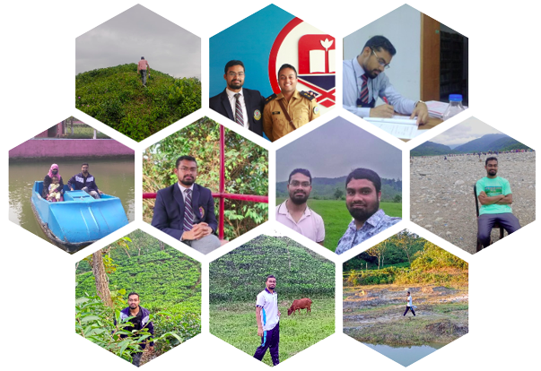
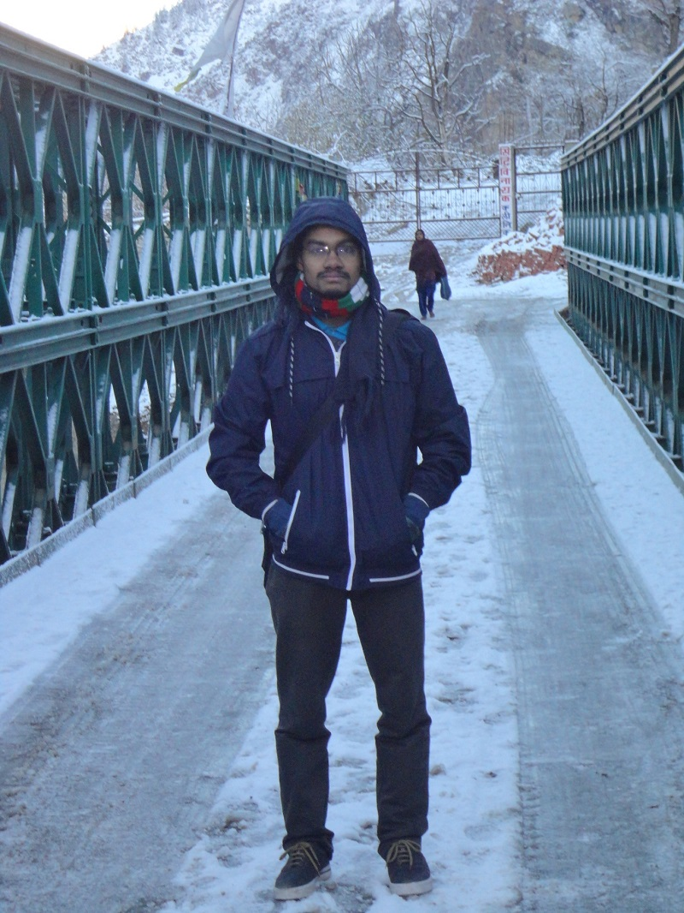
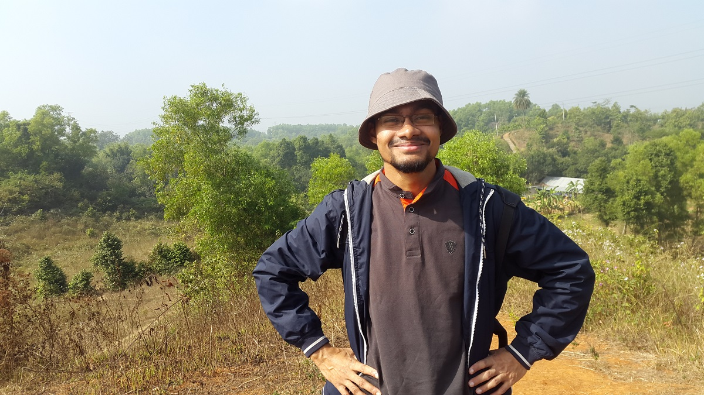
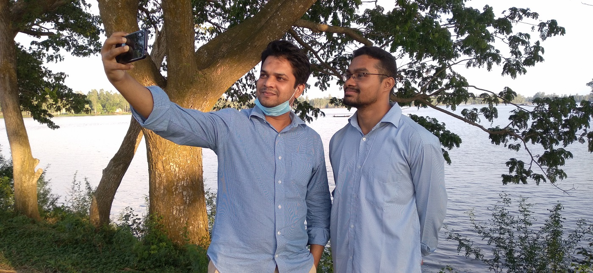

# Gallery {- #gallery}

## Random Moments {- #random-tours}

(\#fig:miu)Lecture At MIU.

(\#fig:sangla)Sangla, Kinnaur, Hiamchal Pradesh, India

(\#fig:lal)Roaming at Lalmai.

(\#fig:cbil)Roaming at Cholonbil.

(\#fig:mill)Roaming in Pabna.

# Websites {-}

- [Statistics Lectures](https://lecture.statmania.info/): Academic Lectures
- [Stat Mania](https://www.statmania.info/): Web portal on statistics (esp. with R programming) and mathematics, and Linux
-  [মহাবিশ্ব](https://sky.bishwo.com):Web portal on astronomy and cosmology
- [Academic Lectures](https://lecture.statmania.info/pres.html)
- [R Programming Online](https://rstat.statmania.info/)
- [Blog](/blog)

# Contact {-}

Scan the QR code below to add my contact details to your phone

(\#fig:unnamed-chunk-1)Contact Details

**Email:** almahmud.sbi[at]gmail.com

**Facebook:** [mahmud.sbi](https://www.facebook.com/mahmud.sbi)

**Linked In:** [mahmudstat](https://www.linkedin.com/in/mahmudstat/t)
