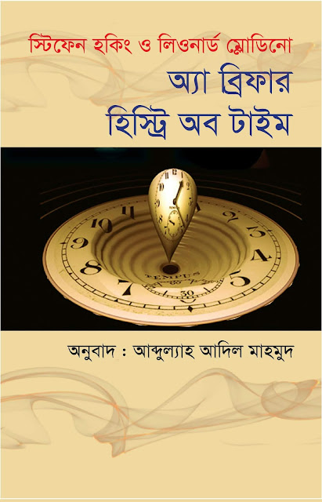
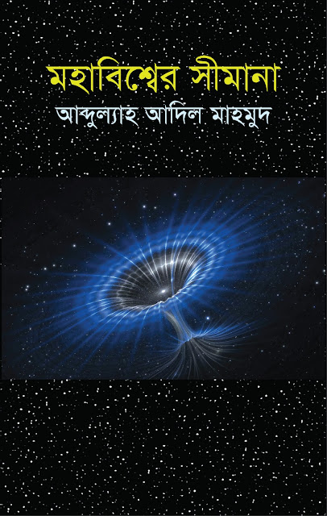
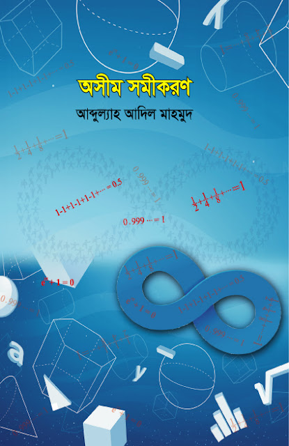
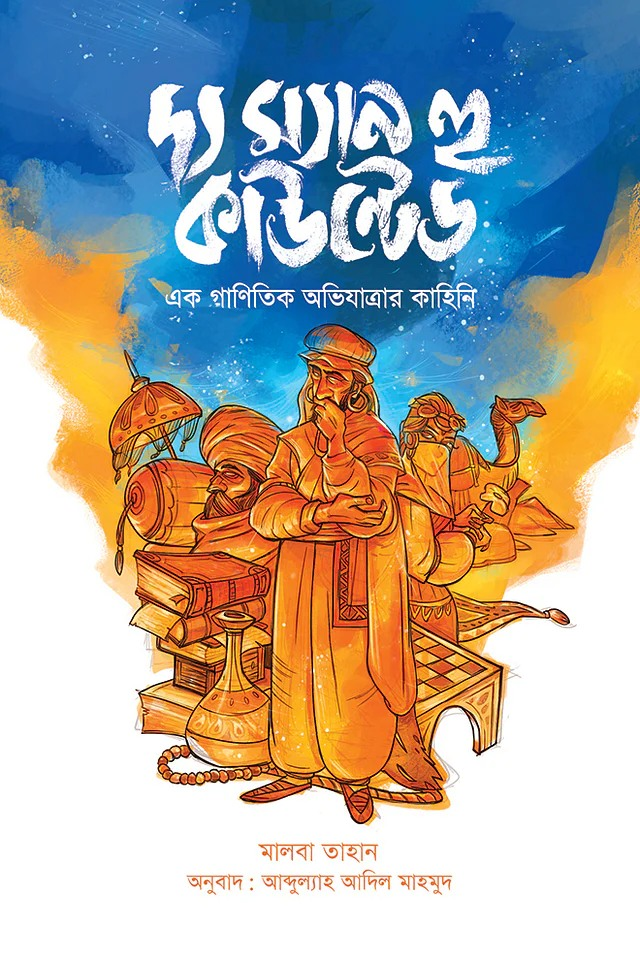

# Roaming

# অ্যা ব্রিফার হিস্ট্রি অব টাইম {#abhot}

প্রকাশ: ২০১৭

প্রকাশক: অন্বেষা প্রকাশন 

কিনুন: [এখান থেকে](https://www.rokomari.com/book/author/47631/abdullah-adil-mahmood) বা [এখান থেকে](https://www.prothoma.com/author/%E0%A6%86%E0%A6%AC%E0%A7%8D%E0%A6%A6%E0%A7%81%E0%A6%B2%E0%A7%8D%E0%A6%AF%E0%A6%BE%E0%A6%B9-%E0%A6%86%E0%A6%A6%E0%A6%BF%E0%A6%B2-%E0%A6%AE%E0%A6%BE%E0%A6%B9%E0%A6%AE%E0%A7%81%E0%A6%A6) 

বিষয়বস্তু: [দেখুন](#/abhot-detail)

## বিস্তারিত {#abhot-detail} 

<blockquote>
আমরা মহাবিশ্ব সম্পর্কে কী জানি? যা জানি তা কীভাবেই বা জানি? মহাবিশ্ব কোথা থেকে আসল এবং ভবিষ্যতে এর কী হতে চলেছে? 
মহাবিশ্ব সম্পর্কে আগের মানুষ কী ভাবত? কীভাবে মানুষ ক্রমেই মহাবিশ্বের সঠিক ধারণা পেয়েছে? মহাবিশ্ব কেন ও কীভাবে সম্প্রসারিত হচ্ছে? কীভাবেই বা আমরা তা জানতে পারলাম? 
ব্ল্যাকহোল কী ও কীভাবে তৈরি হয়? 
টাইম ট্র্যাভেল কীভাবে সম্ভব? মহাবিশ্বের সব সূত্রকে কি একই সুতোয় গাঁথা যাবে? কেমন হবে তার ফলাফল ও অনুভূতি? 
<blockquote/>

# মহাবিশ্বের সীমানা {#ms}

প্রকাশ: ২০১৮

প্রকাশক: অন্বেষা প্রকাশন 

কিনুন: [এখান থেকে](https://www.rokomari.com/book/author/47631/abdullah-adil-mahmood) বা [এখান থেকে](https://www.prothoma.com/author/%E0%A6%86%E0%A6%AC%E0%A7%8D%E0%A6%A6%E0%A7%81%E0%A6%B2%E0%A7%8D%E0%A6%AF%E0%A6%BE%E0%A6%B9-%E0%A6%86%E0%A6%A6%E0%A6%BF%E0%A6%B2-%E0%A6%AE%E0%A6%BE%E0%A6%B9%E0%A6%AE%E0%A7%81%E0%A6%A6) 

বিষয়বস্তু: [দেখুন](#/ms-detail)

## বিস্তারিত {#ms-detail} 

# অসীম সমীকরণ {#os}

প্রকাশ: ২০১৮ 

প্রকাশক: তাম্রলিপি প্রকাশন 

কিনুন: [এখান থেকে](https://www.rokomari.com/book/author/47631/abdullah-adil-mahmood) বা [এখান থেকে](https://www.prothoma.com/author/%E0%A6%86%E0%A6%AC%E0%A7%8D%E0%A6%A6%E0%A7%81%E0%A6%B2%E0%A7%8D%E0%A6%AF%E0%A6%BE%E0%A6%B9-%E0%A6%86%E0%A6%A6%E0%A6%BF%E0%A6%B2-%E0%A6%AE%E0%A6%BE%E0%A6%B9%E0%A6%AE%E0%A7%81%E0%A6%A6) 

বিষয়বস্তু: [দেখুন](#/os-detail)

## বিস্তারিত {#os-detail} 

# দ্য লাস্ট থ্রি মিনিটস {#l3m}

প্রকাশ: ২০২১ 

প্রকাশক: প্রথমা প্রকাশন 

কিনুন: [এখান থেকে](https://www.rokomari.com/book/author/47631/abdullah-adil-mahmood) বা [এখান থেকে](https://www.prothoma.com/author/%E0%A6%86%E0%A6%AC%E0%A7%8D%E0%A6%A6%E0%A7%81%E0%A6%B2%E0%A7%8D%E0%A6%AF%E0%A6%BE%E0%A6%B9-%E0%A6%86%E0%A6%A6%E0%A6%BF%E0%A6%B2-%E0%A6%AE%E0%A6%BE%E0%A6%B9%E0%A6%AE%E0%A7%81%E0%A6%A6) 

বিষয়বস্তু: [দেখুন](#/l3m-detail)

## বিস্তারিত {#l3m-detail} 

# দ্য ম্যান হউ কাউন্টেড {#tmhc}

প্রকাশ: ২০১৭

প্রকাশক: অন্বেষা প্রকাশন 

কিনুন: [এখান থেকে](https://www.rokomari.com/book/author/47631/abdullah-adil-mahmood) বা [এখান থেকে](https://www.prothoma.com/author/%E0%A6%86%E0%A6%AC%E0%A7%8D%E0%A6%A6%E0%A7%81%E0%A6%B2%E0%A7%8D%E0%A6%AF%E0%A6%BE%E0%A6%B9-%E0%A6%86%E0%A6%A6%E0%A6%BF%E0%A6%B2-%E0%A6%AE%E0%A6%BE%E0%A6%B9%E0%A6%AE%E0%A7%81%E0%A6%A6) 

বিষয়বস্তু: [দেখুন](#/tmhc-detail)

## বিস্তারিত {#tmhc-detail} 

# Back Home

[www.thinkermahmud.com](https://www.thinkermahmud.com)
