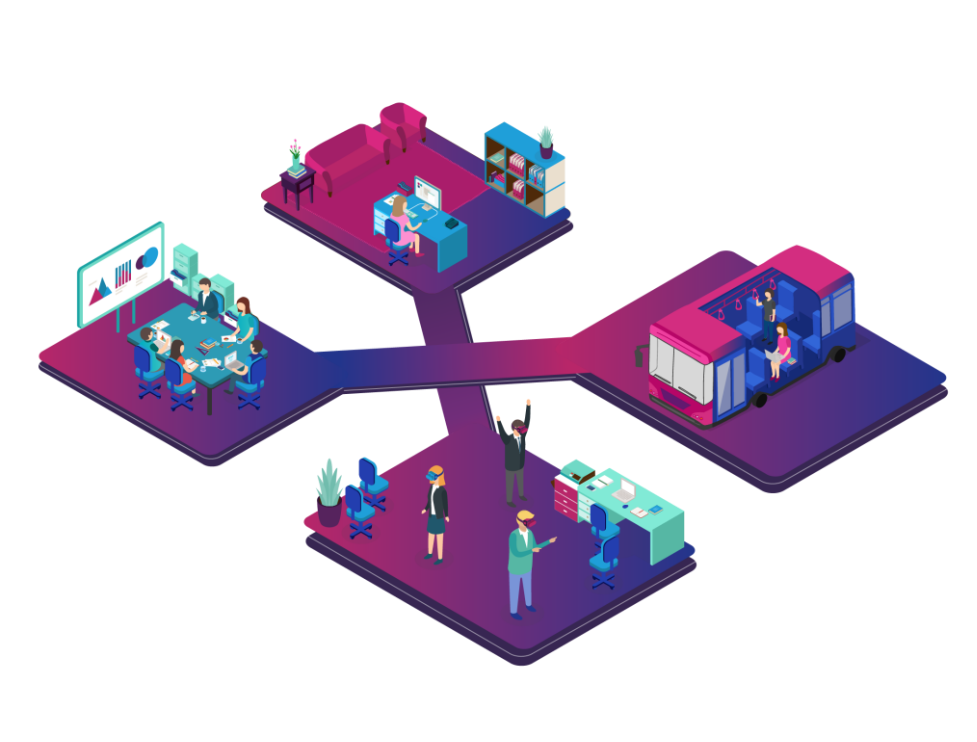

# Basic Info

> - Founded: May, 2012 
> - Created by: MIT & Harvard University
> - Users: 24 million (Sep 2020)
> - Daily Learners: 599,212 on average
> - Courses: 3,000+ courses
> - Instructors: 6,000 
> - Countries: 196

# Sitemap

Can be seen [here](https://www.edx.org/sitemap)

## Homepage Menu

In the menu they have 

- Courses
- Programs
- Online Master's Degrees
- Schools & Partners
- edX for Business 

## Courses vs Programs

Programs include

> - MicroBachelor's Program (gives academic credit)
> - Professional Certificate (Certificate Course-$350-$2000)
> - Micromaster's Program
> - Master's Degree
> - Xseries Program (bundled set of two to seven verified courses in a single subject)

Courses covering many topics

## Search option

> - Search bar to find courses
> - Search by Subject, Partner, Program, Level, Availability, Language

# Content Creator/Partners

- Universities
- Organizations (like Amazon, Amnesty Intl., Google)
- Complete list is available [here](https://www.edx.org/schools-partners)

# Publicity Process

## Social Networks

> - [Facebook](http://www.facebook.com/EdxOnline)
> - [Twitter](https://twitter.com/edXOnline)
> - [LinkedIn](http://www.linkedin.com/company/edx)
> - [Reddit](http://www.reddit.com/r/edx)
> - [Blog](https://blog.edx.org)

## Other Methods

# Course Pattern

In a course there are

> - A short overview
> - Partner name
> - Start date
> - How many are enrolled
> - Enroll now button
> - Complete syllabus

> - Length and effort (per week)
> - Price (for certificate)
> - Prerequisites
> - Instructor Information
> - FAQs

## Inside A Course

- Welcome
- Survey
- Weekly Quiz/Assignment/Lab
- Week Review
- Final Assessment
- Before YOU Go! (Survey and concluding words)

# Mission & Vision

## Mission

> - Increase access to high-quality education for everyone, everywhere
> - Enhance teaching and learning on campus and online
> - Advance teaching and learning through research

# Other Information

## Branches

- Open edX
- edX for Business (to train and develop company employees)

## Open edX

> - Open-source platform software developed by edX 
> - Made freely available to other institutions of higher learning that want to make similar offerings.
> - Available on [GitHub](https://github.com/edx/edx-platform).

## Functionality

> - Courses consist of weekly learning sequences
> - Each sequence is composed of short videos interspersed with interactive learning exercises
> - Students can immediately practice the concepts from the videos

## Certificates

<small>

> - Offers certificates of successful completion 
> - Verified courses: students have the option to audit the course (no cost)
> - Or to work toward an edX Verified Certificate
> - In some courses the examination is only available to paying students.
> - Some courses are credit-eligible
> - Financial assistance are there for those who can't afford

</small>

## Team

> - Leadership (11 people, including )
> - Board of Directors (10)
> - University Advisory Board (15)
> - Global Leadership Board (11)

## THANK YOU!

