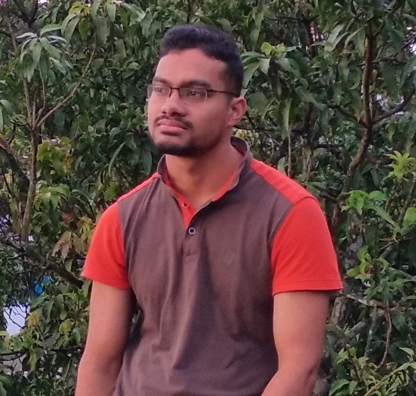

--- 
title: "Abdullah Al Mahmud"
site: bookdown::bookdown_site
output: bookdown::gitbook
documentclass: book
biblio-style: apalike
link-citations: yes
github-repo: mahmudstat/resume
description: "About Abdullah Al Mahmud as updated on `r Sys.Date()`"
---

# About me {-}



I am a **lecturer in statistics** at *Sylhet Cadet College*, Sylhet. Earlier I taught statistics at *Pabna Cadet College*. Before joining Cadet College service, I was employed as a research assistant at *EAL*, Dhaka. I also worked as a science contributor for *The Daily Prothom Alo*. 

I have, with the pen name *Abdullah Adil Mahmud (আব্দুল্যাহ আদিল মাহমুদ)*, written **four science books**, which are all available for purchase on [Rokomari.com](https://www.rokomari.com/book/author/47631).

Hailing from Lakshmipur Sadar Upazila, I graduated with **B.S.** and **M.S.** degrees from the **University of Dhaka**.

I founded [Bishwo.com](https://www.bishwo.com) and serve as the editor and contributor of [মহাবিশ্ব](https://sky.bishwo.com) and [Stat Mania](https://www.statmania.info).

I am very passionate about teaching, writing, programming, and data analysis, and I continue doing all of them.

**Learning** is by far my best hobby. In my free time, I love to roam around, connect with people, and watch sky.

I am married 💓 to Salma Siddika, also an alumna of University of Dhaka.

# Books {-}

All the books are available on [Rokomari.com](https://www.rokomari.com/book/author/47631).

```{r abhot, echo=FALSE, fig.cap = "A Briefer History of Time", fig.align='center', out.width = '60%'}
knitr:: include_graphics(c("img/books/briefer_history_of_time.jpg"))
```

```{r ms, echo=FALSE, fig.cap = "Mohabishwer Simana", fig.align='center', out.width = '60%'}
knitr:: include_graphics(c("img/books/ms.jpg"))
```

```{r os, echo=FALSE, fig.cap = "Osim Somikorn", fig.align='center', out.width = '60%'}
knitr:: include_graphics(c("img/books/cover_os.jpg"))
```

```{r l3m, echo=FALSE, fig.cap = "The Last Three Minutes", fig.align='center', out.width = '60%'}
knitr:: include_graphics(c("books/images/books/l3m.jpg"))
```

[Buy from Rokomari.com](https://www.rokomari.com/book/author/47631)